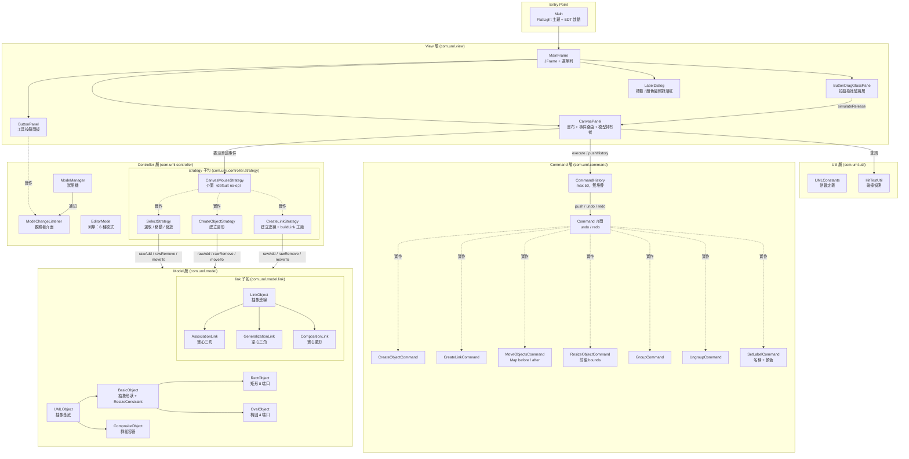
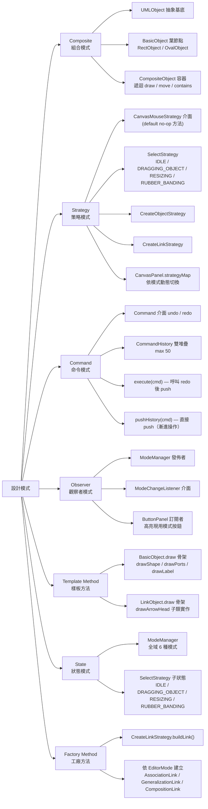
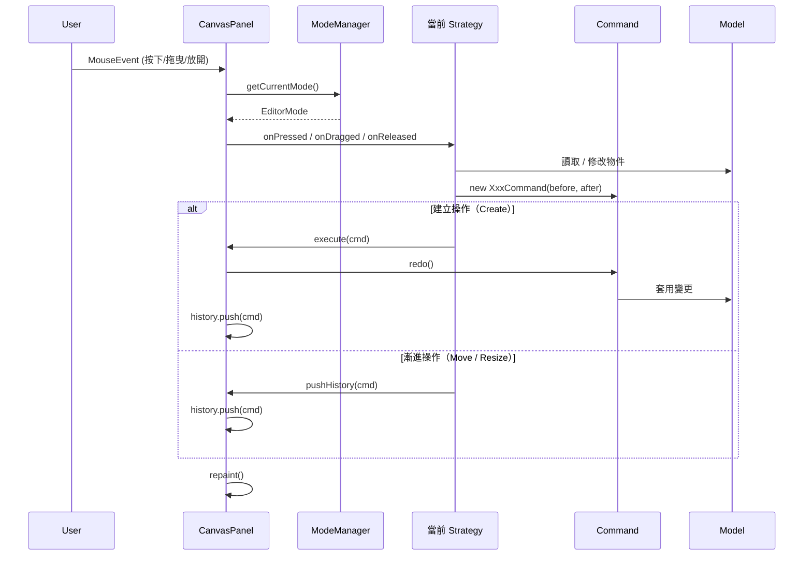
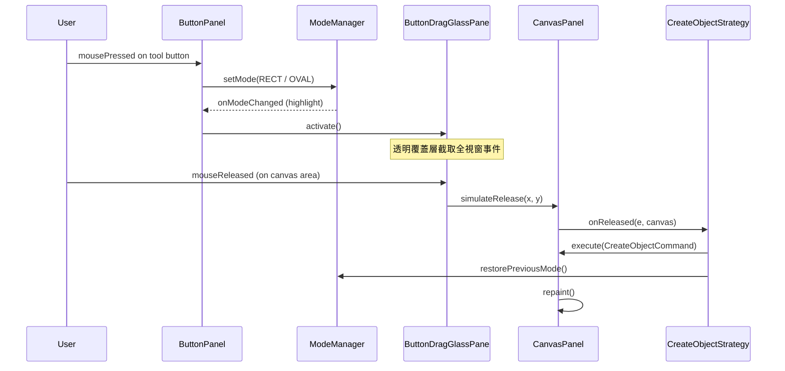
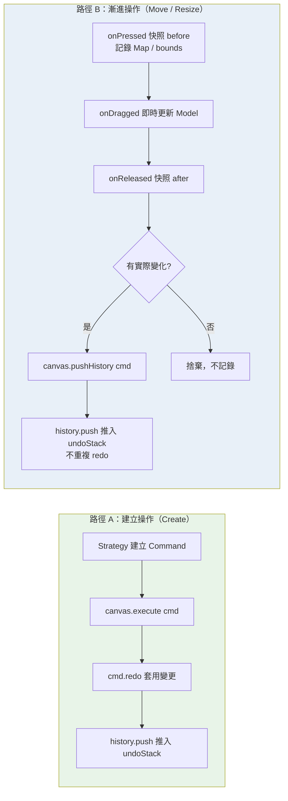
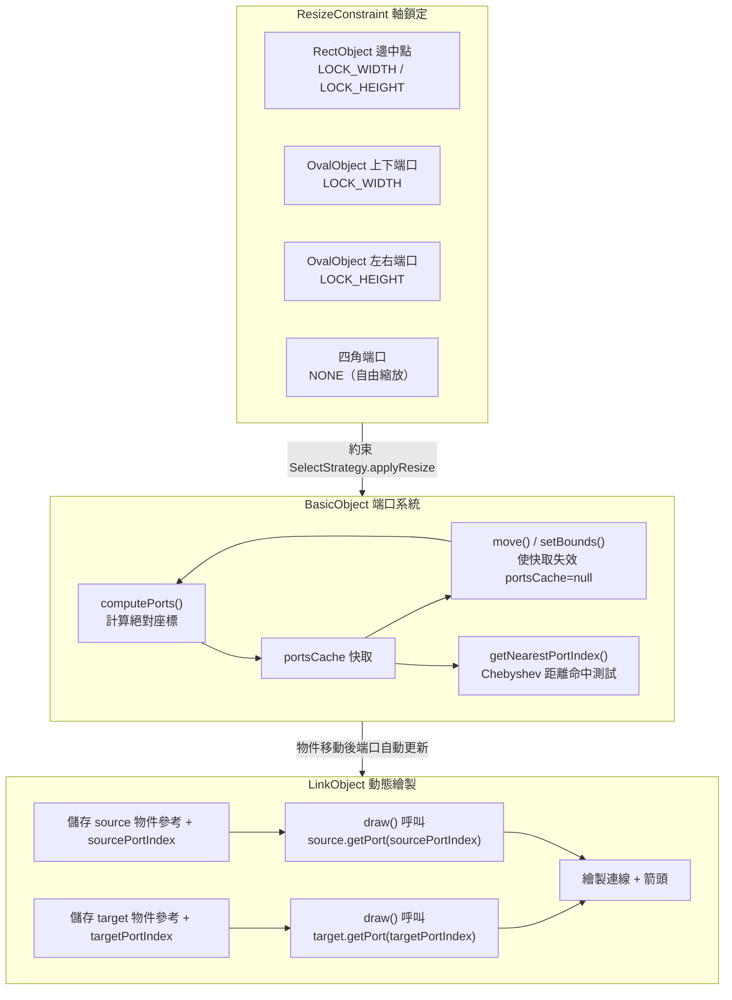
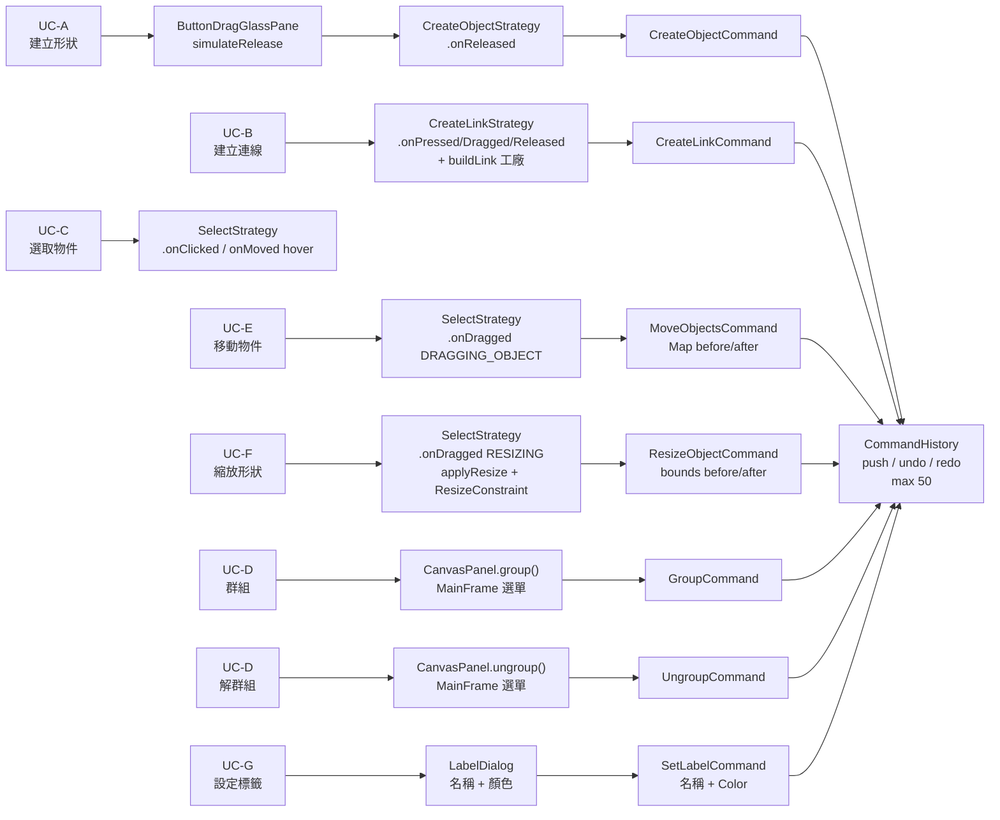

# UML Editor — 架構圖

> 以下使用 Mermaid 圖表，可在 VSCode 安裝 **Markdown Preview Mermaid Support** 擴充套件後預覽。

---

## 1. 分層架構（Layered Architecture）

---

## 2. 設計模式總覽

---

## 3. 類別關係圖（Class Diagram）

```mermaid
classDiagram
    class UMLObject {
        <<abstract>>
        -int depth
        -boolean selected
        -boolean hovered
        -String labelName
        -Color labelColor
        +draw(Graphics2D)*
        +contains(int,int) boolean*
        +getBounds() Rectangle*
        +move(int,int)*
        +moveTo(int,int)*
        +getters/setters()
    }

    class BasicObject {
        <<abstract>>
        -int x
        -int y
        -int width
        -int height
        -List~Point~ portsCache
        +getPorts() List~Point~
        +getPort(int) Point
        +getNearestPortIndex(Point) int
        +getResizeConstraint(int) ResizeConstraint
        +getResizeAnchor(int) Point
        +setBounds(int,int,int,int)
        +draw(Graphics2D)
        #drawShape(Graphics2D)*
        #computePorts() List~Point~*
        -drawPorts(Graphics2D)
        -drawLabel(Graphics2D)
    }

    class ResizeConstraint {
        <<enumeration>>
        NONE
        LOCK_WIDTH
        LOCK_HEIGHT
    }

    class RectObject {
        +computePorts() List~Point~
        +getResizeConstraint(int) ResizeConstraint
        +getResizeAnchor(int) Point
        +drawShape(Graphics2D)
    }

    class OvalObject {
        +computePorts() List~Point~
        +contains(int,int) boolean
        +getResizeConstraint(int) ResizeConstraint
        +getResizeAnchor(int) Point
        +drawShape(Graphics2D)
    }

    class CompositeObject {
        -List~UMLObject~ children
        +getDirectChildren() List~UMLObject~
        +getBounds() Rectangle
        +draw(Graphics2D)
        +move(int,int)
        +moveTo(int,int)
        +addChild(UMLObject)
        +removeChild(UMLObject)
    }

    class LinkObject {
        <<abstract>>
        #BasicObject source
        #int sourcePortIndex
        #BasicObject target
        #int targetPortIndex
        +draw(Graphics2D)
        #drawArrowHead(Graphics2D,Point,Point)*
        -angle(Point,Point) double
        +getSource() BasicObject
        +getTarget() BasicObject
    }

    class AssociationLink {
        +drawArrowHead() 實心三角
    }

    class GeneralizationLink {
        +drawArrowHead() 空心三角
    }

    class CompositionLink {
        +drawArrowHead() 實心菱形
    }

    class CanvasMouseStrategy {
        <<interface>>
        +onPressed(MouseEvent, CanvasPanel)
        +onDragged(MouseEvent, CanvasPanel)
        +onReleased(MouseEvent, CanvasPanel)
        +onMoved(MouseEvent, CanvasPanel)
        +onClicked(MouseEvent, CanvasPanel)
    }

    class SelectStrategy {
        -SubState subState
        -Point pressPoint
        -UMLObject dragTarget
        -int resizePort
        -Point fixedAnchor
        -Map~UMLObject,Point~ moveBefore
    }

    class CreateObjectStrategy {
        -EditorMode objectMode
        -ModeManager modeManager
    }

    class CreateLinkStrategy {
        -EditorMode linkMode
        -BasicObject sourceObject
        -int sourcePortIndex
        -Point tempEnd
        -buildLink(BasicObject,int,BasicObject,int) LinkObject
    }

    class Command {
        <<interface>>
        +undo()
        +redo()
    }

    class CommandHistory {
        -Deque~Command~ undoStack
        -Deque~Command~ redoStack
        -MAX_HISTORY = 50
        +push(Command)
        +undo()
        +redo()
        +canUndo() boolean
        +canRedo() boolean
    }

    class ModeManager {
        -EditorMode currentMode
        -EditorMode previousMode
        -List~ModeChangeListener~ listeners
        +setMode(EditorMode)
        +restorePreviousMode()
        +getCurrentMode() EditorMode
        +addListener(ModeChangeListener)
    }

    class ModeChangeListener {
        <<interface>>
        +onModeChanged(EditorMode, EditorMode)
    }

    class CanvasPanel {
        -List~UMLObject~ objects
        -List~LinkObject~ links
        -CanvasMouseStrategy currentStrategy
        -Map~EditorMode,CanvasMouseStrategy~ strategyMap
        -CommandHistory history
        -Rectangle rubberBand
        +execute(Command)
        +pushHistory(Command)
        +rawAddObject(UMLObject)
        +rawRemoveObject(UMLObject)
        +rawAddLink(LinkObject)
        +rawRemoveLink(LinkObject)
        +group()
        +ungroup()
        +findObjectAt(int,int) UMLObject
        +findBasicObjectNearPort(int,int) BasicObject
        +simulateRelease(int,int)
    }

    class ButtonPanel {
        -Map~EditorMode,JLabel~ buttons
        +onModeChanged(EditorMode, EditorMode)
    }

    class ButtonDragGlassPane {
        -CanvasPanel canvas
        +activate()
        -deactivate()
    }

    UMLObject <|-- BasicObject
    UMLObject <|-- CompositeObject
    BasicObject <|-- RectObject
    BasicObject <|-- OvalObject
    BasicObject ..> ResizeConstraint : uses
    LinkObject --> BasicObject : source / target
    LinkObject <|-- AssociationLink
    LinkObject <|-- GeneralizationLink
    LinkObject <|-- CompositionLink
    CanvasMouseStrategy <|.. SelectStrategy
    CanvasMouseStrategy <|.. CreateObjectStrategy
    CanvasMouseStrategy <|.. CreateLinkStrategy
    Command <|.. CreateObjectCommand
    Command <|.. CreateLinkCommand
    Command <|.. MoveObjectsCommand
    Command <|.. ResizeObjectCommand
    Command <|.. GroupCommand
    Command <|.. UngroupCommand
    Command <|.. SetLabelCommand
    CommandHistory --> Command : manages
    ModeManager --> ModeChangeListener : notifies
    ModeChangeListener <|.. ButtonPanel
    CanvasPanel --> CommandHistory : owns
    CanvasPanel --> CanvasMouseStrategy : delegates
    ButtonDragGlassPane --> CanvasPanel : simulateRelease
```

---

## 4. 核心流程：滑鼠事件路由

---

## 5. 按鈕拖拽建立物件（ButtonDragGlassPane 流程）

---

## 6. 兩種 Command 執行路徑

---

## 7. 端口（Port）系統與連線動態追蹤

---

## 8. Use Case 對應實作

