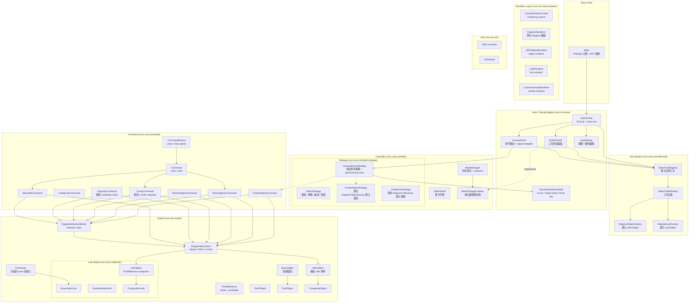
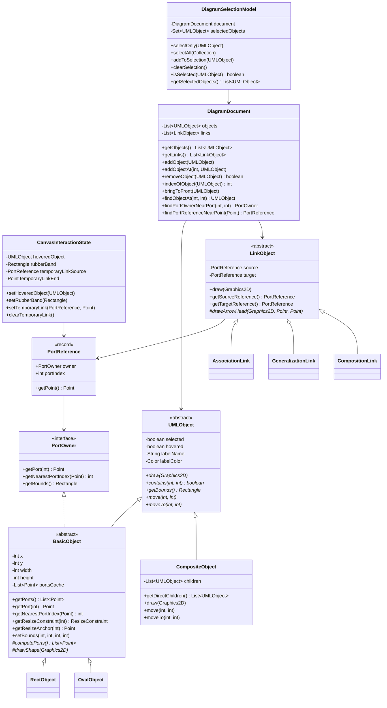
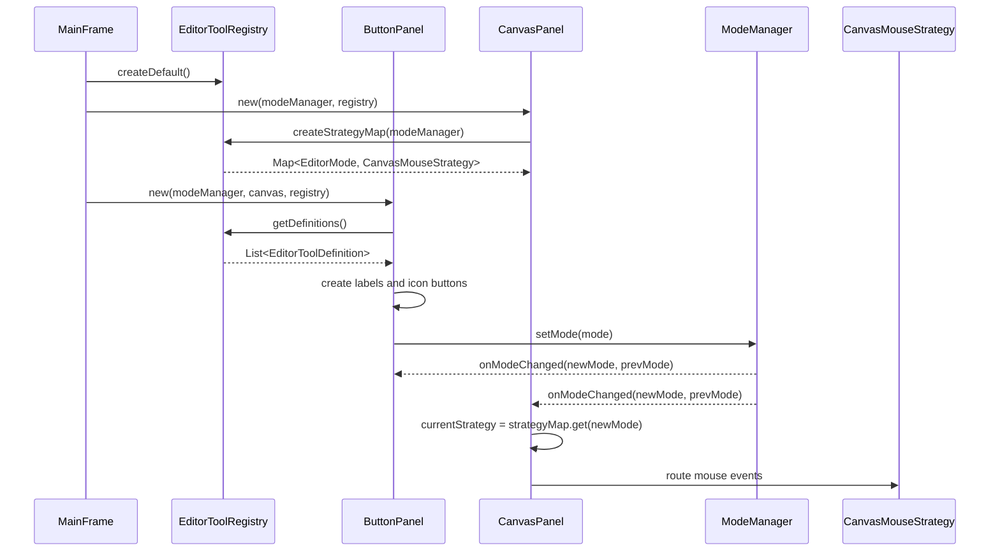
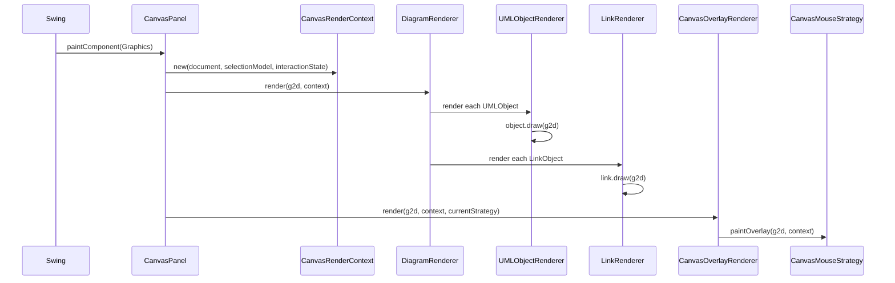
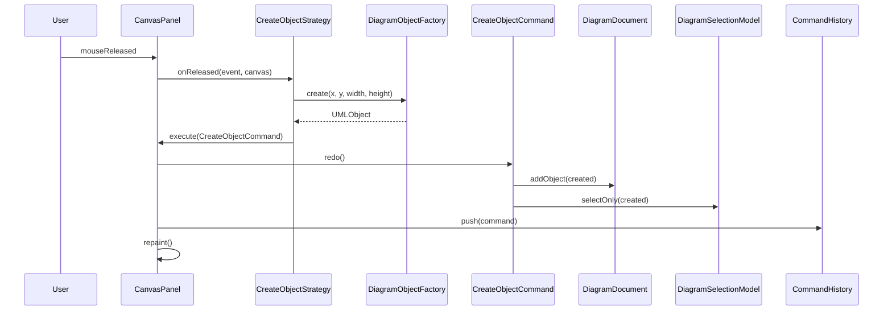
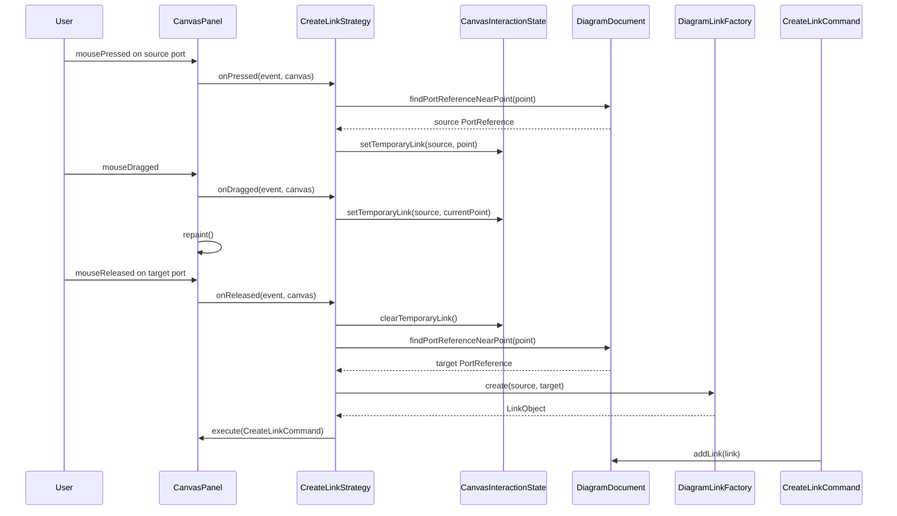
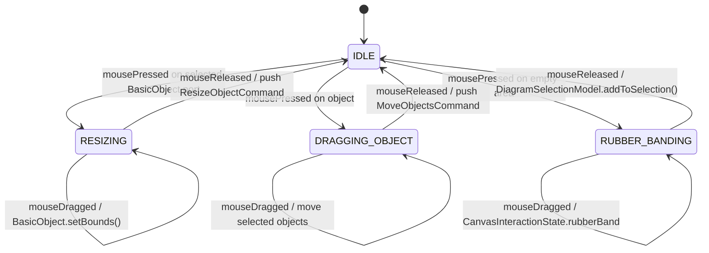
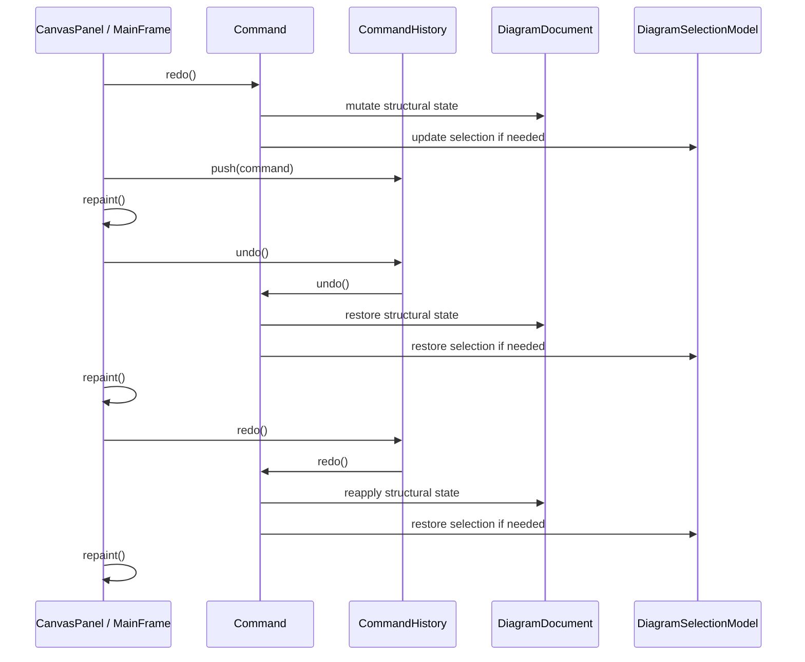
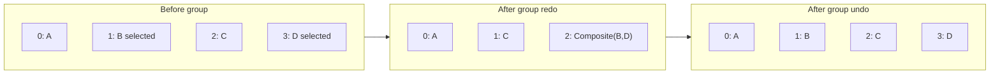
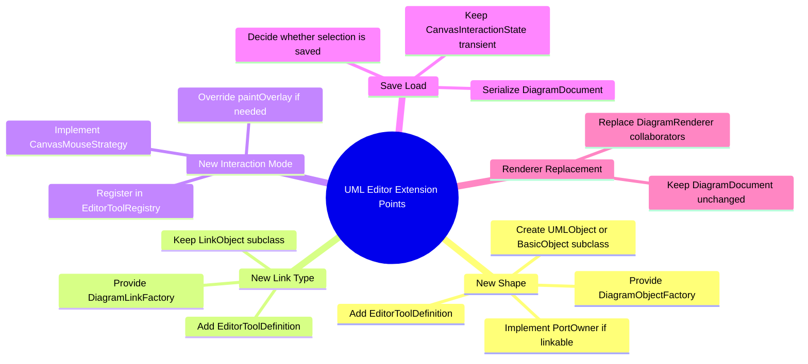

# UML Editor — Refactored Architecture

> 以下圖表使用 Mermaid。此文件描述目前實作架構：需求功能不變，但為了長期擴充性，將原本集中在 `CanvasPanel` 的模型資料、選取狀態、互動暫態、工具建立、繪製與 Command 操作拆成明確協作者。

---

## 1. 分層架構（Layered Architecture）

```mermaid
graph TB
    subgraph ENTRY["Entry Point"]
        MAIN["Main<br>FlatLight 主題 + EDT 啟動"]
    end

    subgraph VIEW["View / Swing Adapter (com.uml.view)"]
        MF["MainFrame<br>JFrame + menu bar"]
        BP["ButtonPanel<br>工具按鈕面板"]
        CP["CanvasPanel<br>事件路由 + repaint adapter"]
        LD["LabelDialog<br>標籤 / 顏色編輯"]
        CIS["CanvasInteractionState<br>hover / rubber band / temp link"]
    end

    subgraph RENDER["Renderer Layer (com.uml.view.renderer)"]
        CRC["CanvasRenderContext<br>rendering context"]
        DR["DiagramRenderer<br>整份 diagram 繪製"]
        UOR["UMLObjectRenderer<br>object renderer"]
        LR["LinkRenderer<br>link renderer"]
        COR["CanvasOverlayRenderer<br>overlay renderer"]
    end

    subgraph TOOL["Tool System (com.uml.controller.tool)"]
        ETR["EditorToolRegistry<br>集中註冊工具"]
        ETD["EditorToolDefinition<br>工具定義"]
        DOF["DiagramObjectFactory<br>建立 UMLObject"]
        DLF["DiagramLinkFactory<br>建立 LinkObject"]
    end

    subgraph CTL["Controller (com.uml.controller)"]
        MM["ModeManager<br>目前模式 + observer"]
        EM["EditorMode<br>模式列舉"]
        MCL["ModeChangeListener<br>模式變更觀察者"]
        subgraph STR["Strategy (com.uml.controller.strategy)"]
            CMS["CanvasMouseStrategy<br>滑鼠事件策略 + paintOverlay hook"]
            SS["SelectStrategy<br>選取 / 移動 / 縮放 / 框選"]
            COS["CreateObjectStrategy<br>透過 DiagramObjectFactory 建立圖形"]
            CLS["CreateLinkStrategy<br>透過 DiagramLinkFactory 建立連線"]
        end
    end

    subgraph CMD["Command (com.uml.command)"]
        CI["Command<br>undo / redo"]
        CH["CommandHistory<br>undo / redo stacks"]
        COC["CreateObjectCommand"]
        CLC["CreateLinkCommand"]
        MOC["MoveObjectsCommand"]
        ROC["ResizeObjectCommand"]
        GC["GroupCommand<br>保留 z-order snapshot"]
        UGC["UngroupCommand<br>保留 composite index"]
        SLC["SetLabelCommand"]
    end

    subgraph MODEL["Model (com.uml.model)"]
        DOC["DiagramDocument<br>objects / links / z-order"]
        SEL["DiagramSelectionModel<br>selection state"]
        UO["UMLObject<br>抽象 UML 物件"]
        BO["BasicObject<br>基礎圖形"]
        PO["PortOwner<br>可提供 ports 的能力"]
        PR["PortReference<br>owner + portIndex"]
        RO["RectObject"]
        OO["OvalObject"]
        CO["CompositeObject"]
        subgraph LNK["Link Model (com.uml.model.link)"]
            LO["LinkObject<br>PortReference endpoints"]
            AL["AssociationLink"]
            GL["GeneralizationLink"]
            CML["CompositionLink"]
        end
    end

    subgraph UTIL["Util (com.uml.util)"]
        UC["UMLConstants"]
        HTU["HitTestUtil"]
    end

    MAIN --> MF
    MF --> BP
    MF --> CP
    MF --> LD
    MF --> ETR
    BP --> ETR
    CP --> ETR
    ETR --> ETD
    ETD --> DOF
    ETD --> DLF

    MM --> MCL
    BP -.implements.-> MCL
    CP --> CMS
    CMS --> CIS
    CMS -.-> COS
    CMS -.-> COC
    CI --> MOC
    CI --> GC
    CI --> SLC
    CH --> CI
    COC --> DOC
    COC --> SEL
    MOC --> DOC
    MOC --> SEL
    ROC --> DOC
    ROC --> SEL
    GC --> DOC
    GC --> SEL
    UGC --> DOC
    UGC --> SEL
    SLC --> DOC
    SLC --> SEL

    DOC --> UO
    DOC --> LO
    SEL --> DOC
    UO --> CO
    BO --> OO
    PO --> AL
    LO --> CML
```

---

## 2. 核心類別關係（Class Diagram）

```mermaid
classDiagram
    class DiagramDocument {
        -List~UMLObject~ objects
        -List~LinkObject~ links
        +getObjects() List~UMLObject~
        +getLinks() List~LinkObject~
        +addObject(UMLObject)
        +addObjectAt(int, UMLObject)
        +removeObject(UMLObject) boolean
        +indexOfObject(UMLObject) int
        +bringToFront(UMLObject)
        +findObjectAt(int, int) UMLObject
        +findPortOwnerNearPort(int, int) PortOwner
        +findPortReferenceNearPoint(Point) PortReference
    }

    class DiagramSelectionModel {
        -DiagramDocument document
        -Set~UMLObject~ selectedObjects
        +selectOnly(UMLObject)
        +selectAll(Collection)
        +addToSelection(UMLObject)
        +clearSelection()
        +isSelected(UMLObject) boolean
        +getSelectedObjects() List~UMLObject~
    }

    class CanvasInteractionState {
        -UMLObject hoveredObject
        -Rectangle rubberBand
        -PortReference temporaryLinkSource
        -Point temporaryLinkEnd
        +setHoveredObject(UMLObject)
        +setRubberBand(Rectangle)
        +setTemporaryLink(PortReference, Point)
        +clearTemporaryLink()
    }

    class UMLObject {
        <<abstract>>
        -boolean selected
        -boolean hovered
        -String labelName
        -Color labelColor
        +draw(Graphics2D)*
        +contains(int, int) boolean*
        +getBounds() Rectangle*
        +move(int, int)*
        +moveTo(int, int)*
    }

    class PortOwner {
        <<interface>>
        +getPort(int) Point
        +getNearestPortIndex(Point) int
        +getBounds() Rectangle
    }

    class BasicObject {
        <<abstract>>
        -int x
        -int y
        -int width
        -int height
        -List~Point~ portsCache
        +getPorts() List~Point~
        +getPort(int) Point
        +getNearestPortIndex(Point) int
        +getResizeConstraint(int) ResizeConstraint
        +getResizeAnchor(int) Point
        +setBounds(int, int, int, int)
        #computePorts() List~Point~*
        #drawShape(Graphics2D)*
    }

    class PortReference {
        <<record>>
        +PortOwner owner
        +int portIndex
        +getPoint() Point
    }

    class LinkObject {
        <<abstract>>
        -PortReference source
        -PortReference target
        +draw(Graphics2D)
        +getSourceReference() PortReference
        +getTargetReference() PortReference
        #drawArrowHead(Graphics2D, Point, Point)*
    }

    class CompositeObject {
        -List~UMLObject~ children
        +getDirectChildren() List~UMLObject~
        +draw(Graphics2D)
        +move(int, int)
        +moveTo(int, int)
    }

    DiagramDocument --> UMLObject
    DiagramDocument --> LinkObject
    DiagramSelectionModel --> DiagramDocument
    CanvasInteractionState --> PortReference
    UMLObject <|-- BasicObject
    UMLObject <|-- CompositeObject
    BasicObject <|-- RectObject
    BasicObject <|-- OvalObject
    PortOwner <|.. BasicObject
    LinkObject --> PortReference
    PortReference --> PortOwner
    LinkObject <|-- AssociationLink
    LinkObject <|-- GeneralizationLink
    LinkObject <|-- CompositionLink
```

---

## 3. 工具註冊與模式切換（Tool Registry Flow）

`EditorToolRegistry` 是工具系統的唯一來源。`ButtonPanel` 用它建立按鈕，`CanvasPanel` 用它建立 strategy map，因此新增工具不需要分散修改 UI 與 canvas。

```mermaid
sequenceDiagram
    participant MF as MainFrame
    participant Registry as EditorToolRegistry
    participant BP as ButtonPanel
    participant CP as CanvasPanel
    participant MM as ModeManager
    participant Strategy as CanvasMouseStrategy

    MF->>Registry: createDefault()
    MF->>CP: new(modeManager, registry)
    CP->>Registry: createStrategyMap(modeManager)
    Registry-->>CP: Map<EditorMode, CanvasMouseStrategy>
    MF->>BP: new(modeManager, canvas, registry)
    BP->>Registry: getDefinitions()
    Registry-->>BP: List<EditorToolDefinition>
    BP->>BP: create labels and icon buttons

    BP->>MM: setMode(mode)
    MM-->>BP: onModeChanged(newMode, prevMode)
    MM-->>CP: onModeChanged(newMode, prevMode)
    CP->>CP: currentStrategy = strategyMap.get(newMode)
    CP->>Strategy: route mouse events
```

---

## 4. 繪製流程（Rendering Pipeline）

`CanvasPanel` 不直接繪製 diagram 細節。它建立 `CanvasRenderContext` 後，委派給 `DiagramRenderer` 畫物件與連線，再由 `CanvasOverlayRenderer` 呼叫目前 strategy 的 `paintOverlay`。

```mermaid
sequenceDiagram
    participant Swing
    participant CP as CanvasPanel
    participant Context as CanvasRenderContext
    participant DR as DiagramRenderer
    participant OR as UMLObjectRenderer
    participant LR as LinkRenderer
    participant Overlay as CanvasOverlayRenderer
    participant Strategy as CanvasMouseStrategy

    Swing->>CP: paintComponent(Graphics)
    CP->>Context: new(document, selectionModel, interactionState)
    CP->>DR: render(g2d, context)
    DR->>OR: render each UMLObject
    OR->>OR: object.draw(g2d)
    DR->>LR: render each LinkObject
    LR->>LR: link.draw(g2d)
    CP->>Overlay: render(g2d, context, currentStrategy)
    Overlay->>Strategy: paintOverlay(g2d, context)
```

---

## 5. 建立物件流程（Create Object）

```mermaid
sequenceDiagram
    participant User
    participant CP as CanvasPanel
    participant Strategy as CreateObjectStrategy
    participant Factory as DiagramObjectFactory
    participant Cmd as CreateObjectCommand
    participant Doc as DiagramDocument
    participant Sel as DiagramSelectionModel
    participant Hist as CommandHistory

    User->>CP: mouseReleased
    CP->>Strategy: onReleased(event, canvas)
    Strategy->>Factory: create(x, y, width, height)
    Factory-->>Strategy: UMLObject
    Strategy->>CP: execute(CreateObjectCommand)
    CP->>Cmd: redo()
    Cmd->>Doc: addObject(created)
    Cmd->>Sel: selectOnly(created)
    CP->>Hist: push(command)
    CP->>CP: repaint()
```

---

## 6. 建立連線流程（Create Link）

```mermaid
sequenceDiagram
    participant User
    participant CP as CanvasPanel
    participant Strategy as CreateLinkStrategy
    participant State as CanvasInteractionState
    participant Doc as DiagramDocument
    participant Factory as DiagramLinkFactory
    participant Cmd as CreateLinkCommand

    User->>CP: mousePressed on source port
    CP->>Strategy: onPressed(event, canvas)
    Strategy->>Doc: findPortReferenceNearPoint(point)
    Doc-->>Strategy: source PortReference
    Strategy->>State: setTemporaryLink(source, point)

    User->>CP: mouseDragged
    CP->>Strategy: onDragged(event, canvas)
    Strategy->>State: setTemporaryLink(source, currentPoint)
    CP->>CP: repaint()

    User->>CP: mouseReleased on target port
    CP->>Strategy: onReleased(event, canvas)
    Strategy->>State: clearTemporaryLink()
    Strategy->>Doc: findPortReferenceNearPoint(point)
    Doc-->>Strategy: target PortReference
    Strategy->>Factory: create(source, target)
    Factory-->>Strategy: LinkObject
    Strategy->>CP: execute(CreateLinkCommand)
    Cmd->>Doc: addLink(link)
```

---

## 7. 選取模式狀態機（Select Strategy State）

```mermaid
stateDiagram-v2
    [*] --> IDLE
    IDLE --> RESIZING: mousePressed on selected BasicObject port
    IDLE --> DRAGGING_OBJECT: mousePressed on object
    IDLE --> RUBBER_BANDING: mousePressed on empty area

    RESIZING --> RESIZING: mouseDragged / BasicObject.setBounds()
    RESIZING --> IDLE: mouseReleased / push ResizeObjectCommand

    DRAGGING_OBJECT --> DRAGGING_OBJECT: mouseDragged / move selected objects
    DRAGGING_OBJECT --> IDLE: mouseReleased / push MoveObjectsCommand

    RUBBER_BANDING --> RUBBER_BANDING: mouseDragged / CanvasInteractionState.rubberBand
    RUBBER_BANDING --> IDLE: mouseReleased / DiagramSelectionModel.addToSelection()
```

---

## 8. Command 與 Undo/Redo

Command 不再操作 `CanvasPanel.rawAddObject()` 之類的 view adapter API。Command 只修改 `DiagramDocument`，必要時更新 `DiagramSelectionModel`。`CanvasPanel` 負責統一 `repaint()`。

```mermaid
sequenceDiagram
    participant UI as CanvasPanel / MainFrame
    participant Cmd as Command
    participant Hist as CommandHistory
    participant Doc as DiagramDocument
    participant Sel as DiagramSelectionModel

    UI->>Cmd: redo()
    Cmd->>Doc: mutate structural state
    Cmd->>Sel: update selection if needed
    UI->>Hist: push(command)
    UI->>UI: repaint()

    UI->>Hist: undo()
    Hist->>Cmd: undo()
    Cmd->>Doc: restore structural state
    Cmd->>Sel: restore selection if needed
    UI->>UI: repaint()

    UI->>Hist: redo()
    Hist->>Cmd: redo()
    Cmd->>Doc: reapply structural state
    Cmd->>Sel: restore selection if needed
    UI->>UI: repaint()
```

---

## 9. Group / Ungroup 的 z-order 還原

群組時會記錄每個 child 的原始 index，並把 composite 插到被群組物件中最高層的位置。undo 時 children 回原本 z-order；redo 時 composite 回記錄位置。解群組時則記錄 composite index，children 從該位置展開。

```mermaid
flowchart LR
    subgraph Before["Before group"]
        A1["0: A"]
        B1["1: B selected"]
        C1["2: C"]
        D1["3: D selected"]
    end

    subgraph Redo["After group redo"]
        A2["0: A"]
        C2["1: C"]
        G2["2: Composite(B,D)"]
    end

    subgraph Undo["After group undo"]
        A3["0: A"]
        B3["1: B"]
        C3["2: C"]
        D3["3: D"]
    end

    Before --> Redo
    Redo --> Undo
```

---

## 10. 擴充點（Extension Points）

```mermaid
mindmap
  root((UML Editor Extension Points))
    New Shape
      Create UMLObject or BasicObject subclass
      Implement PortOwner if linkable
      Add EditorToolDefinition
      Provide DiagramObjectFactory
    New Link Type
      Keep LinkObject subclass
      Provide DiagramLinkFactory
      Add EditorToolDefinition
    New Interaction Mode
      Implement CanvasMouseStrategy
      Override paintOverlay if needed
      Register in EditorToolRegistry
    Save Load
      Serialize DiagramDocument
      Keep CanvasInteractionState transient
      Decide whether selection is saved
    Renderer Replacement
      Replace DiagramRenderer collaborators
      Keep DiagramDocument unchanged
```

---

## 11. 實做設計理由與取捨

### 11.1 `DiagramDocument`：分離 Document Model 與 Swing View

過去 `CanvasPanel` 同時持有 objects、links、z-order、hit-test、Command raw mutation。這讓畫布元件變成 model repository，也讓 undo/redo、save/load、測試都必須繞過 Swing。

現在 `DiagramDocument` 負責 diagram 結構資料。好處是：

- `CanvasPanel` 可以回到 Swing adapter 的角色。
- Command 可以直接測試，不需要建立視窗。
- 未來 save/load 有明確入口。
- z-order 操作集中，group/ungroup undo 才能穩定還原順序。

取捨是多一個 document 類別，對小型程式短期看起來較重；但這個抽象對 editor 類程式是長期穩定核心。

### 11.2 `DiagramSelectionModel` 與 `CanvasInteractionState`：分離 Domain State 與 UI State

選取、hover、rubber band、temporary link preview 都是 UI 暫態，不是 UML 物件本身的語意。重構後：

- `DiagramSelectionModel` 管理 selected objects。
- `CanvasInteractionState` 管理 hover、框選矩形、暫時連線預覽。
- `UMLObject.selected` / `hovered` 暫時保留作為相容 flag，避免一次搬太深。

這樣未來若同一份 diagram 有多個 view，不同 view 可以有不同 selection/hover，不會污染核心 document。

### 11.3 Strategy Pattern：隔離滑鼠互動模式

`CanvasMouseStrategy` 讓 select、create object、create link 的滑鼠行為彼此獨立。新增一種互動模式時，只要新增 strategy 並註冊工具，不需要把一大串 if/switch 塞進 `CanvasPanel`。

這次新增 `paintOverlay(Graphics2D, CanvasRenderContext)` hook，讓每個 strategy 自己負責它的 overlay：

- `SelectStrategy` 畫 rubber band。
- `CreateLinkStrategy` 畫 temporary link preview。

因此原先預留但未使用的 `CanvasOverlay` interface 已移除。現在不需要另一套 overlay object model；等未來真的需要多個 overlay 物件、overlay lifecycle、或 overlay composition 時，再引入也不遲。

### 11.4 Registry + Factory：把工具建立集中化

`EditorToolRegistry` 集中管理工具定義。每個 `EditorToolDefinition` 包含：

- `EditorMode`
- 顯示 label
- icon
- strategy factory
- object/link factory
- 是否為 object creation tool

這採用 Registry + Factory 的組合，解決原本新增工具要同時改 `ButtonPanel`、`CanvasPanel`、`CreateObjectStrategy`、`CreateLinkStrategy` 的問題。現在新增圖形或連線時，主要新增一筆工具定義與對應 factory。

取捨是 registry 本身稍微集中，但它集中的是「工具組裝資訊」，不是業務流程，因此比散落在 UI/controller 裡更容易維護。

### 11.5 `PortOwner` / `PortReference`：用能力介面取代具體類別依賴

原本 link endpoint 被綁死在 `BasicObject + int portIndex`。這表示只有 `BasicObject` 子類才能被連線。

現在：

- `PortOwner` 表示「此物件提供 ports」。
- `BasicObject` 實作 `PortOwner`。
- `PortReference` 持有 `PortOwner owner + portIndex`。
- `LinkObject` 依賴 `PortReference`。

這讓未來的 package、note、interface、甚至某些 composite，只要實作 `PortOwner` 就能成為連線端點，而不必硬塞進 `BasicObject` 繼承樹。

### 11.6 Command Pattern：把 Undo/Redo 從 View 中解耦

Command 仍維持 `undo()` / `redo()`，但目標改為 `DiagramDocument` 和必要的 `DiagramSelectionModel`。這讓 Command 不再需要 `CanvasPanel.rawAddObject()`，也不負責 repaint。

好處是：

- Command 可純單元測試。
- View 更新由 `CanvasPanel.execute/undo/redo` 統一處理。
- group/ungroup 可以記錄 z-order snapshot 並穩定還原。

### 11.7 Composite Pattern：維持群組語意

`CompositeObject` 仍是 Composite Pattern 的 composite 角色。它與 `BasicObject` 一樣繼承 `UMLObject`，所以 draw、move、contains、getBounds 可以被 `CanvasPanel` / `DiagramRenderer` 一視同仁處理。

這個 pattern 適合 group/ungroup 需求，因為群組本質上是「物件包含物件」的樹狀結構。取捨是 composite 的 selection/port/linkability 需要額外政策；目前 composite 不實作 `PortOwner`，所以仍不能直接作為連線端點。

### 11.8 Template Method：保留圖形與連線繪製骨架

`BasicObject.draw()` 定義形狀、port、label 的繪製流程；子類只實作 `drawShape()` 與 `computePorts()`。`LinkObject.draw()` 定義線段繪製流程，子類只實作 `drawArrowHead()`。

這保留現有行為與簡潔性，也避免為了重構一次搬動所有 rendering code。renderer layer 目前先委派既有 `draw()`，未來若要完全去除 model 對 `Graphics2D` 的依賴，可以逐步把實際繪製搬到 `UMLObjectRenderer` / `LinkRenderer`。

### 11.9 Renderer Layer：先建立邊界，不急著大搬繪圖細節

`DiagramRenderer`、`UMLObjectRenderer`、`LinkRenderer`、`CanvasOverlayRenderer` 的目的，是讓 `CanvasPanel.paintComponent` 不再知道 diagram 的細節。短期它們仍呼叫 `object.draw()` 與 `link.draw()`，這是刻意取捨：

- 降低一次性重構風險。
- 保持視覺行為相容。
- 先讓 render pipeline 的依賴方向正確。

未來若要輸出圖片、切換繪圖後端、或將 model 變成純資料，可以再逐步把 `Graphics2D` 依賴搬出 model。

### 11.10 明確不做的事

- 不改三個 link subclass 成 ArrowHead strategy，因為目前 link subclass 數量少，直接保留更單純。
- 不移除逐行註解與 `System.out.println`，因為這次需求是架構重構，不是風格清理。
- 不把 selection/hover flag 從 `UMLObject` 立刻刪除，因為 renderer 仍委派舊 `draw()`；先透過 `DiagramSelectionModel` / `CanvasInteractionState` 統一同步，後續再逐步清掉相容欄位。
