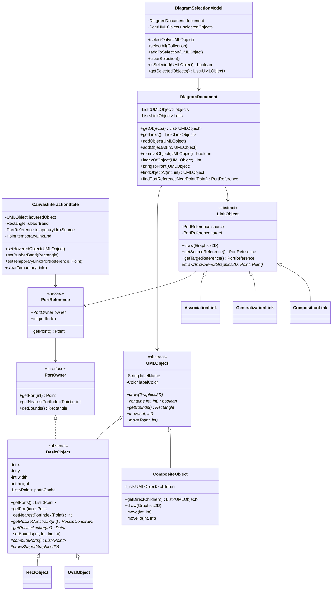
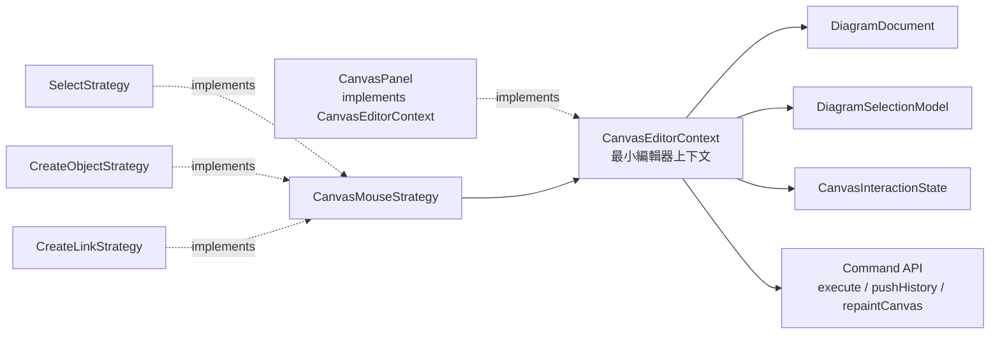
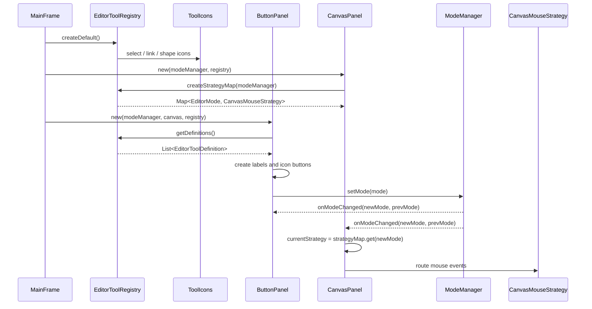
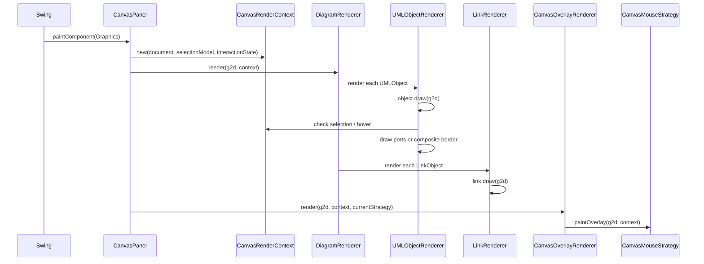
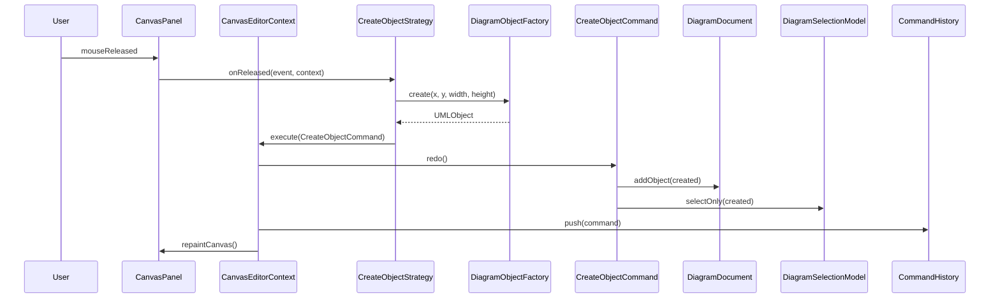
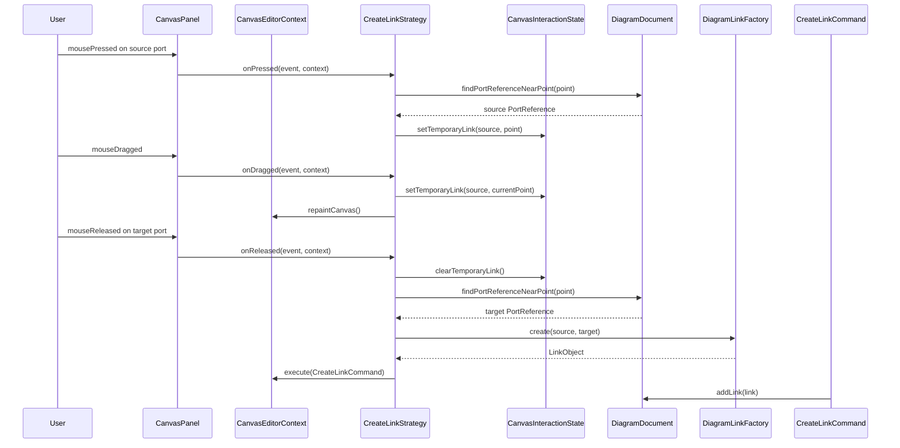
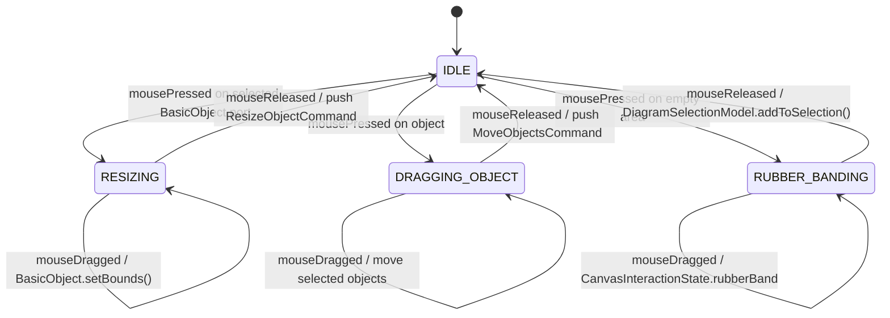
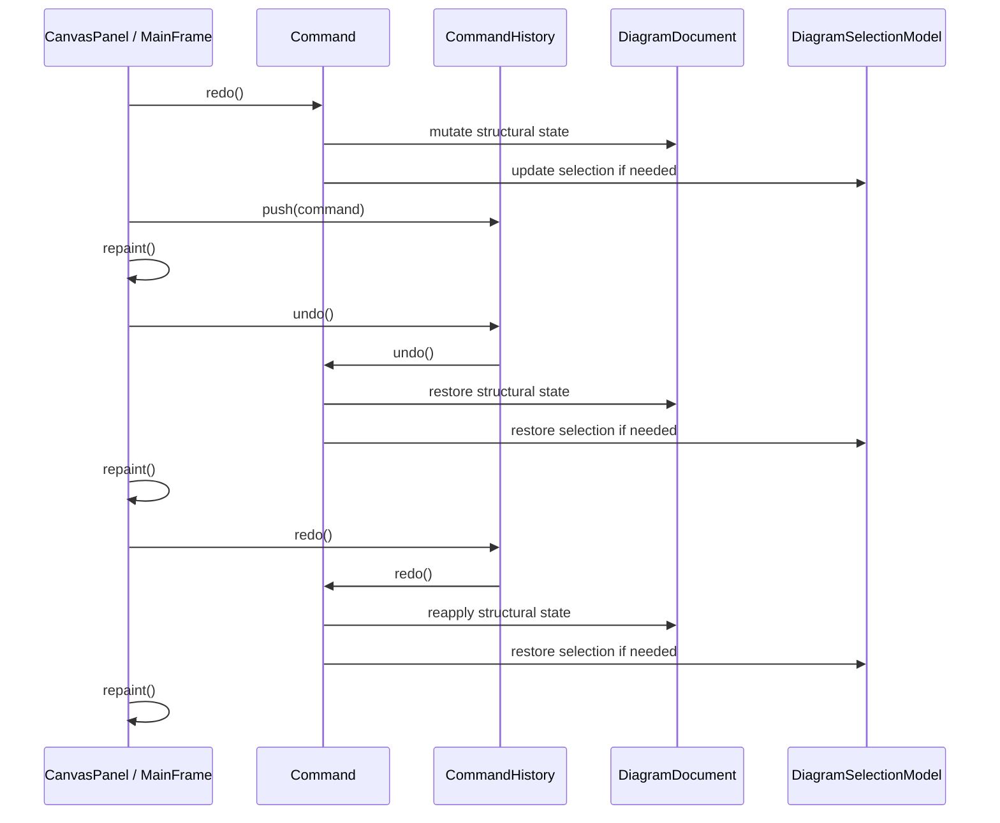
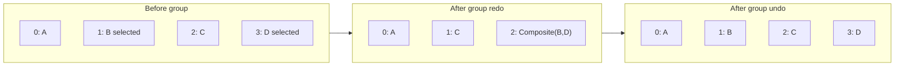
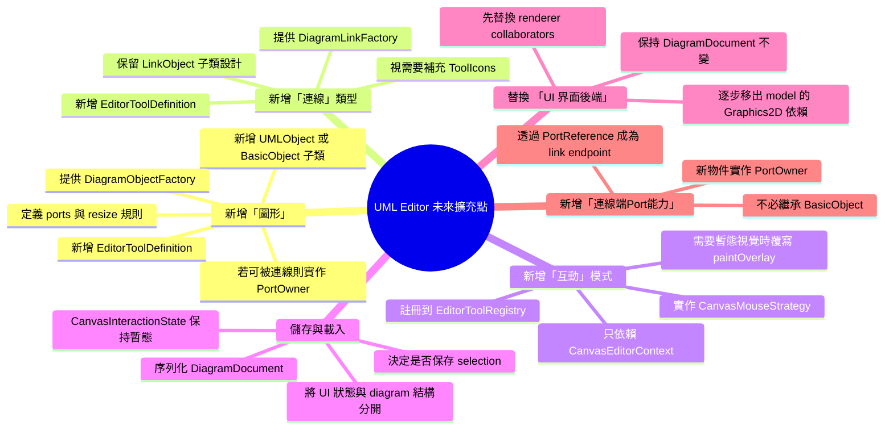

# UML Editor — Refactored Architecture

> 以下圖表使用 Mermaid。此文件描述目前實作架構：需求功能不變，但為了長期擴充性，將原本集中在 `CanvasPanel` 的模型資料、選取狀態、互動暫態、工具建立、繪製與 Command 操作拆成明確協作者。

---

## 0. 專案交接導覽（Domain / Package Overview）

如果你要接手這個專案，可以先用「編輯器核心資料、互動控制、Swing 外殼、繪製、命令歷史」幾個 domain 來理解，而不是從單一 UI 類別一路追。

| 目錄 / Package | 設計用途 | 主要類別 | 維護時要注意 |
|---|---|---|---|
| `src/main/java/com/uml` | 應用程式入口 | `Main` | 只負責設定 Look & Feel 並在 EDT 建立 `MainFrame`，不要把 editor 流程塞到這裡。 |
| `com.uml.model` | Diagram 的核心資料與狀態模型 | `DiagramDocument`, `DiagramSelectionModel`, `PortOwner`, `PortReference` | `DiagramDocument` 是 objects、links、z-order 的唯一結構來源；selection 由 `DiagramSelectionModel` 管理，不回寫到 `UMLObject`。 |
| `com.uml.model.object` | UML 物件階層 | `UMLObject`, `BasicObject`, `RectObject`, `OvalObject`, `CompositeObject` | `BasicObject` 子類必須定義 ports、繪製形狀、resize constraint 與 resize anchor；群組用 `CompositeObject` 表示。 |
| `com.uml.model.link` | UML 連線階層 | `LinkObject`, `AssociationLink`, `GeneralizationLink`, `CompositionLink` | link endpoint 是 `PortReference`，不是具體 `BasicObject`；目前保留三個 link subclass，暫不抽 arrow head strategy。 |
| `com.uml.command` | Undo / Redo 的行為封裝 | `Command`, `CommandHistory`, `CreateObjectCommand`, `GroupCommand`, `SetLabelCommand` 等 | Command 只操作 `DiagramDocument` 與必要的 `DiagramSelectionModel`，不依賴 `CanvasPanel`、不自行 repaint。 |
| `com.uml.controller.mode` | 編輯模式狀態與 Observer | `EditorMode`, `ModeManager`, `ModeChangeListener` | 模式切換由 `ModeManager` 廣播；`ButtonPanel` 更新高亮，`CanvasPanel` 切換 current strategy。 |
| `com.uml.controller.strategy` | 滑鼠互動策略 | `CanvasMouseStrategy`, `CanvasEditorContext`, `SelectStrategy`, `CreateObjectStrategy`, `CreateLinkStrategy` | Strategy 只依賴 `CanvasEditorContext`，不要直接依賴 Swing `CanvasPanel`。需要畫暫態視覺時覆寫 `paintOverlay`。 |
| `com.uml.controller.tool` | 工具註冊與 factory | `EditorToolRegistry`, `EditorToolDefinition`, `DiagramObjectFactory`, `DiagramLinkFactory` | 新增工具時優先新增 tool definition；避免把工具清單散落在 `ButtonPanel` 和 `CanvasPanel`。 |
| `com.uml.view` | Swing 視窗與 adapter | `MainFrame`, `CanvasPanel`, `ButtonPanel`, `LabelDialog`, `CanvasInteractionState` | `CanvasPanel` 是 Swing adapter：轉發事件、建立 render context、執行 command、repaint。hover、rubber band、temp link 放在 `CanvasInteractionState`。 |
| `com.uml.view.renderer` | 畫布繪製 pipeline | `DiagramRenderer`, `UMLObjectRenderer`, `LinkRenderer`, `CanvasOverlayRenderer`, `CanvasRenderContext` | selected / hovered 視覺由 renderer 根據 context 判斷；model 的 `draw()` 目前仍畫本體，未來可逐步移出 AWT 依賴。 |
| `com.uml.view.toolicon` | 工具列圖示 | `ToolIcons` | 集中產生工具圖示，讓 `EditorToolRegistry` 可提供 icon，`ButtonPanel` 不必知道圖示細節。 |
| `com.uml.util` | 共用常數與 hit-test helper | `UMLConstants`, `HitTestUtil` | 放跨 domain 且無狀態的小工具；避免把 domain 流程藏進 util。 |
| `src/test/java/com/uml` | 單元測試 | command/model/tool registry tests | 測試重點放在 document、selection、command、registry 等不需要啟動 Swing 的核心邏輯。 |

目前最重要的互動關係可以這樣記：

1. `MainFrame` 組裝 `ModeManager`、`EditorToolRegistry`、`CanvasPanel`、`ButtonPanel`。
2. `ButtonPanel` 從 `EditorToolRegistry` 建工具按鈕，點擊後只切換 `ModeManager`。
3. `CanvasPanel` 從 `EditorToolRegistry` 建 strategy map，收到滑鼠事件後把事件交給目前 `CanvasMouseStrategy`。
4. Strategy 透過 `CanvasEditorContext` 讀寫 document、selection、interaction state，並透過 command API 產生可 undo/redo 的變更。
5. `CanvasPanel.paintComponent` 建立 `CanvasRenderContext`，依序呼叫 diagram renderer 與 overlay renderer。
6. `DiagramRenderer` 畫 document 結構，`UMLObjectRenderer` 根據 selection/hover context 補 ports 或 composite border。

---

## 1. 分層架構（Layered Architecture）

```mermaid
graph TB
    subgraph ENTRY["Entry Point"]
        MAIN["Main<br>FlatLight 主題 + EDT 啟動"]
    end

    subgraph VIEW["View / Swing Adapter (com.uml.view)"]
        MF["MainFrame<br>JFrame + menu bar"]
        BP["ButtonPanel<br>工具按鈕面板"]
        CP["CanvasPanel<br>事件路由 + repaint adapter"]
        LD["LabelDialog<br>標籤 / 顏色編輯"]
        CIS["CanvasInteractionState<br>hover / rubber band / temp link"]
        TI["ToolIcons<br>工具圖示"]
    end

    subgraph RENDER["Renderer Layer (com.uml.view.renderer)"]
        CRC["CanvasRenderContext<br>rendering context"]
        DR["DiagramRenderer<br>整份 diagram 繪製"]
        UOR["UMLObjectRenderer<br>object renderer"]
        LR["LinkRenderer<br>link renderer"]
        COR["CanvasOverlayRenderer<br>overlay renderer"]
    end

    subgraph TOOL["Tool System (com.uml.controller.tool)"]
        ETR["EditorToolRegistry<br>集中註冊工具"]
        ETD["EditorToolDefinition<br>工具定義"]
        DOF["DiagramObjectFactory<br>建立 UMLObject"]
        DLF["DiagramLinkFactory<br>建立 LinkObject"]
    end

    subgraph MODE["Mode System (com.uml.controller.mode)"]
        MM["ModeManager<br>目前模式 + observer"]
        EM["EditorMode<br>模式列舉"]
        MCL["ModeChangeListener<br>模式變更觀察者"]
    end

    subgraph CTL["Controller Strategy (com.uml.controller.strategy)"]
        subgraph STR["Strategy (com.uml.controller.strategy)"]
            CMS["CanvasMouseStrategy<br>滑鼠事件 strategy  + paintOverlay hook"]
            CEC["CanvasEditorContext<br>strategy 最小上下文"]
            SS["SelectStrategy<br>選取 / 移動 / 縮放 / 框選"]
            COS["CreateObjectStrategy<br>透過 DiagramObjectFactory 建立圖形"]
            CLS["CreateLinkStrategy<br>透過 DiagramLinkFactory 建立連線"]
        end
    end

    subgraph CMD["Command (com.uml.command)"]
        CI["Command<br>undo / redo"]
        CH["CommandHistory<br>undo / redo stacks"]
        COC["CreateObjectCommand"]
        CLC["CreateLinkCommand"]
        MOC["MoveObjectsCommand"]
        ROC["ResizeObjectCommand"]
        GC["GroupCommand<br>保留 z-order snapshot"]
        UGC["UngroupCommand<br>保留 composite index"]
        SLC["SetLabelCommand"]
    end

    subgraph MODEL["Model (com.uml.model)"]
        DOC["DiagramDocument<br>objects / links / z-order"]
        SEL["DiagramSelectionModel<br>selection state"]
        UO["UMLObject<br>抽象 UML 物件"]
        BO["BasicObject<br>基礎圖形"]
        PO["PortOwner<br>可提供 ports 的能力"]
        PR["PortReference<br>owner + portIndex"]
        RO["RectObject"]
        OO["OvalObject"]
        CO["CompositeObject"]
        subgraph LNK["Link Model (com.uml.model.link)"]
            LO["LinkObject<br>PortReference endpoints"]
            AL["AssociationLink"]
            GL["GeneralizationLink"]
            CML["CompositionLink"]
        end
    end

    subgraph UTIL["Util (com.uml.util)"]
        UC["UMLConstants"]
        HTU["HitTestUtil"]
    end

    MAIN --> MF
    MF --> BP
    MF --> CP
    MF --> LD
    MF --> ETR
    MF --> MM
    BP --> ETR
    BP --> TI
    CP --> ETR
    ETR --> ETD
    ETR --> TI
    ETD --> DOF
    ETD --> DLF

    MM --> EM
    MM --> MCL
    BP -.-> MCL
    CP --> CMS
    CP -.-> CEC
    CMS --> CEC
    SS -.-> CMS
    COS -.-> CMS
    CLS -.-> CMS
    SS --> DOC
    SS --> SEL
    SS --> CIS
    COS --> DOF
    CLS --> DLF
    CI -.-> CLC
    CI -.-> ROC
    CI -.-> UGC
    CI -.-> BO
    UO -.-> RO
    BO -.-> BO
    PR --> PO
    LO --> PR
    LO -.-> GL
    LO -.-> CML
```

---

## 2. 核心類別關係（Class Diagram）

```mermaid
classDiagram
    class DiagramDocument {
        -List~UMLObject~ objects
        -List~LinkObject~ links
        +getObjects() List~UMLObject~
        +getLinks() List~LinkObject~
        +addObject(UMLObject)
        +addObjectAt(int, UMLObject)
        +removeObject(UMLObject) boolean
        +indexOfObject(UMLObject) int
        +bringToFront(UMLObject)
        +findObjectAt(int, int) UMLObject
        +findPortReferenceNearPoint(Point) PortReference
    }

    class DiagramSelectionModel {
        -DiagramDocument document
        -Set~UMLObject~ selectedObjects
        +selectOnly(UMLObject)
        +selectAll(Collection)
        +addToSelection(UMLObject)
        +clearSelection()
        +isSelected(UMLObject) boolean
        +getSelectedObjects() List~UMLObject~
    }

    class CanvasInteractionState {
        -UMLObject hoveredObject
        -Rectangle rubberBand
        -PortReference temporaryLinkSource
        -Point temporaryLinkEnd
        +setHoveredObject(UMLObject)
        +setRubberBand(Rectangle)
        +setTemporaryLink(PortReference, Point)
        +clearTemporaryLink()
    }

    class UMLObject {
        <<abstract>>
        -String labelName
        -Color labelColor
        +draw(Graphics2D)*
        +contains(int, int) boolean*
        +getBounds() Rectangle*
        +move(int, int)*
        +moveTo(int, int)*
    }

    class PortOwner {
        <<interface>>
        +getPort(int) Point
        +getNearestPortIndex(Point) int
        +getBounds() Rectangle
    }

    class BasicObject {
        <<abstract>>
        -int x
        -int y
        -int width
        -int height
        -List~Point~ portsCache
        +getPorts() List~Point~
        +getPort(int) Point
        +getNearestPortIndex(Point) int
        +getResizeConstraint(int) ResizeConstraint*
        +getResizeAnchor(int) Point*
        +setBounds(int, int, int, int)
        #computePorts() List~Point~*
        #drawShape(Graphics2D)*
    }

    class PortReference {
        <<record>>
        +PortOwner owner
        +int portIndex
        +getPoint() Point
    }

    class LinkObject {
        <<abstract>>
        -PortReference source
        -PortReference target
        +draw(Graphics2D)
        +getSourceReference() PortReference
        +getTargetReference() PortReference
        #drawArrowHead(Graphics2D, Point, Point)*
    }

    class CompositeObject {
        -List~UMLObject~ children
        +getDirectChildren() List~UMLObject~
        +draw(Graphics2D)
        +move(int, int)
        +moveTo(int, int)
    }

    DiagramDocument --> UMLObject
    DiagramDocument --> LinkObject
    DiagramSelectionModel --> DiagramDocument
    CanvasInteractionState --> PortReference
    UMLObject <|-- BasicObject
    UMLObject <|-- CompositeObject
    BasicObject <|-- RectObject
    BasicObject <|-- OvalObject
    PortOwner <|.. BasicObject
    LinkObject --> PortReference
    PortReference --> PortOwner
    LinkObject <|-- AssociationLink
    LinkObject <|-- GeneralizationLink
    LinkObject <|-- CompositionLink
```

---

## 2.1 Strategy 與 Context 邊界（Dependency Boundary）

滑鼠 strategy 不直接依賴 `CanvasPanel`。`CanvasPanel` 只是目前的 Swing adapter，並透過 `CanvasEditorContext` 暴露 strategy 真正需要的最小能力。

```mermaid
graph LR
    CP["CanvasPanel<br>implements CanvasEditorContext"]
    CEC["CanvasEditorContext<br>最小編輯器上下文"]
    CMS["CanvasMouseStrategy"]
    SS["SelectStrategy"]
    COS["CreateObjectStrategy"]
    CLS["CreateLinkStrategy"]
    DOC["DiagramDocument"]
    SEL["DiagramSelectionModel"]
    CIS["CanvasInteractionState"]
    CMD["Command API<br>execute / pushHistory / repaintCanvas"]

    CP -.implements.-> CEC
    SS -.implements.-> CMS
    COS -.implements.-> CMS
    CLS -.implements.-> CMS
    CMS --> CEC
    CEC --> DOC
    CEC --> SEL
    CEC --> CIS
    CEC --> CMD
```

---

## 3. 工具註冊與模式切換（Tool Registry Flow）

`EditorToolRegistry` 是工具系統的唯一來源。`ButtonPanel` 用它建立按鈕，`CanvasPanel` 用它建立 strategy map，因此新增工具不需要分散修改 UI 與 canvas。

```mermaid
sequenceDiagram
    participant MF as MainFrame
    participant Registry as EditorToolRegistry
    participant Icons as ToolIcons
    participant BP as ButtonPanel
    participant CP as CanvasPanel
    participant MM as ModeManager
    participant Strategy as CanvasMouseStrategy

    MF->>Registry: createDefault()
    Registry->>Icons: select / link / shape icons
    MF->>CP: new(modeManager, registry)
    CP->>Registry: createStrategyMap(modeManager)
    Registry-->>CP: Map<EditorMode, CanvasMouseStrategy>
    MF->>BP: new(modeManager, canvas, registry)
    BP->>Registry: getDefinitions()
    Registry-->>BP: List<EditorToolDefinition>
    BP->>BP: create labels and icon buttons

    BP->>MM: setMode(mode)
    MM-->>BP: onModeChanged(newMode, prevMode)
    MM-->>CP: onModeChanged(newMode, prevMode)
    CP->>CP: currentStrategy = strategyMap.get(newMode)
    CP->>Strategy: route mouse events
```

---

## 4. 繪製流程（Rendering Pipeline）

`CanvasPanel` 不直接繪製 diagram 細節。它建立 `CanvasRenderContext` 後，委派給 `DiagramRenderer` 畫物件與連線，再由 `CanvasOverlayRenderer` 呼叫目前 strategy 的 `paintOverlay`。

```mermaid
sequenceDiagram
    participant Swing
    participant CP as CanvasPanel
    participant Context as CanvasRenderContext
    participant DR as DiagramRenderer
    participant OR as UMLObjectRenderer
    participant LR as LinkRenderer
    participant Overlay as CanvasOverlayRenderer
    participant Strategy as CanvasMouseStrategy

    Swing->>CP: paintComponent(Graphics)
    CP->>Context: new(document, selectionModel, interactionState)
    CP->>DR: render(g2d, context)
    DR->>OR: render each UMLObject
    OR->>OR: object.draw(g2d)
    OR->>Context: check selection / hover
    OR->>OR: draw ports or composite border
    DR->>LR: render each LinkObject
    LR->>LR: link.draw(g2d)
    CP->>Overlay: render(g2d, context, currentStrategy)
    Overlay->>Strategy: paintOverlay(g2d, context)
```

---

## 5. 建立物件流程（Create Object）

```mermaid
sequenceDiagram
    participant User
    participant CP as CanvasPanel
    participant Context as CanvasEditorContext
    participant Strategy as CreateObjectStrategy
    participant Factory as DiagramObjectFactory
    participant Cmd as CreateObjectCommand
    participant Doc as DiagramDocument
    participant Sel as DiagramSelectionModel
    participant Hist as CommandHistory

    User->>CP: mouseReleased
    CP->>Strategy: onReleased(event, context)
    Strategy->>Factory: create(x, y, width, height)
    Factory-->>Strategy: UMLObject
    Strategy->>Context: execute(CreateObjectCommand)
    Context->>Cmd: redo()
    Cmd->>Doc: addObject(created)
    Cmd->>Sel: selectOnly(created)
    Context->>Hist: push(command)
    Context->>CP: repaintCanvas()
```

---

## 6. 建立連線流程（Create Link）

```mermaid
sequenceDiagram
    participant User
    participant CP as CanvasPanel
    participant Context as CanvasEditorContext
    participant Strategy as CreateLinkStrategy
    participant State as CanvasInteractionState
    participant Doc as DiagramDocument
    participant Factory as DiagramLinkFactory
    participant Cmd as CreateLinkCommand

    User->>CP: mousePressed on source port
    CP->>Strategy: onPressed(event, context)
    Strategy->>Doc: findPortReferenceNearPoint(point)
    Doc-->>Strategy: source PortReference
    Strategy->>State: setTemporaryLink(source, point)

    User->>CP: mouseDragged
    CP->>Strategy: onDragged(event, context)
    Strategy->>State: setTemporaryLink(source, currentPoint)
    Strategy->>Context: repaintCanvas()

    User->>CP: mouseReleased on target port
    CP->>Strategy: onReleased(event, context)
    Strategy->>State: clearTemporaryLink()
    Strategy->>Doc: findPortReferenceNearPoint(point)
    Doc-->>Strategy: target PortReference
    Strategy->>Factory: create(source, target)
    Factory-->>Strategy: LinkObject
    Strategy->>Context: execute(CreateLinkCommand)
    Cmd->>Doc: addLink(link)
```

---

## 7. 選取模式狀態機（Select Strategy State）

```mermaid
stateDiagram-v2
    [*] --> IDLE
    IDLE --> RESIZING: mousePressed on selected BasicObject port
    IDLE --> DRAGGING_OBJECT: mousePressed on object
    IDLE --> RUBBER_BANDING: mousePressed on empty area

    RESIZING --> RESIZING: mouseDragged / BasicObject.setBounds()
    RESIZING --> IDLE: mouseReleased / push ResizeObjectCommand

    DRAGGING_OBJECT --> DRAGGING_OBJECT: mouseDragged / move selected objects
    DRAGGING_OBJECT --> IDLE: mouseReleased / push MoveObjectsCommand

    RUBBER_BANDING --> RUBBER_BANDING: mouseDragged / CanvasInteractionState.rubberBand
    RUBBER_BANDING --> IDLE: mouseReleased / DiagramSelectionModel.addToSelection()
```

---

## 8. Command 與 Undo/Redo

Command 不再操作 view adapter API。Command 只修改 `DiagramDocument`，必要時更新 `DiagramSelectionModel`。`CanvasPanel` 負責統一 `repaint()`。

```mermaid
sequenceDiagram
    participant UI as CanvasPanel / MainFrame
    participant Cmd as Command
    participant Hist as CommandHistory
    participant Doc as DiagramDocument
    participant Sel as DiagramSelectionModel

    UI->>Cmd: redo()
    Cmd->>Doc: mutate structural state
    Cmd->>Sel: update selection if needed
    UI->>Hist: push(command)
    UI->>UI: repaint()

    UI->>Hist: undo()
    Hist->>Cmd: undo()
    Cmd->>Doc: restore structural state
    Cmd->>Sel: restore selection if needed
    UI->>UI: repaint()

    UI->>Hist: redo()
    Hist->>Cmd: redo()
    Cmd->>Doc: reapply structural state
    Cmd->>Sel: restore selection if needed
    UI->>UI: repaint()
```

---

## 9. Group / Ungroup 的 z-order 還原

群組時會記錄每個 child 的原始 index，並把 composite 插到被群組物件中最高層的位置。undo 時 children 回原本 z-order；redo 時 composite 回記錄位置。解群組時則記錄 composite index，children 從該位置展開。

```mermaid
flowchart LR
    subgraph Before["Before group"]
        A1["0: A"]
        B1["1: B selected"]
        C1["2: C"]
        D1["3: D selected"]
    end

    subgraph Redo["After group redo"]
        A2["0: A"]
        C2["1: C"]
        G2["2: Composite(B,D)"]
    end

    subgraph Undo["After group undo"]
        A3["0: A"]
        B3["1: B"]
        C3["2: C"]
        D3["3: D"]
    end

    Before --> Redo
    Redo --> Undo
```

---

## 10. 擴充點（Extension Points）

```mermaid
mindmap
  root((UML Editor 未來擴充點))
    新增「圖形」
      新增 UMLObject 或 BasicObject 子類
      若可被連線則實作 PortOwner
      定義 ports 與 resize 規則
      新增 EditorToolDefinition
      提供 DiagramObjectFactory
    新增「連線」類型
      保留 LinkObject 子類設計
      提供 DiagramLinkFactory
      新增 EditorToolDefinition
      視需要補充 ToolIcons
    新增「互動」模式
      實作 CanvasMouseStrategy
      只依賴 CanvasEditorContext
      需要暫態視覺時覆寫 paintOverlay
      註冊到 EditorToolRegistry
    儲存與載入
      序列化 DiagramDocument
      CanvasInteractionState 保持暫態
      決定是否保存 selection
      將 UI 狀態與 diagram 結構分開
    替換 「UI 界面後端」
      先替換 renderer collaborators
      逐步移出 model 的 Graphics2D 依賴
      保持 DiagramDocument 不變
    新增「連線端Port能力」
      新物件實作 PortOwner
      透過 PortReference 成為 link endpoint
      不必繼承 BasicObject
```

---

## 11. 實做設計理由與取捨

### 11.1 `DiagramDocument`：分離 Document Model 與 Swing View

過去 `CanvasPanel` 同時持有 objects、links、z-order、hit-test、Command raw mutation。這讓畫布元件變成 model repository，也讓 undo/redo、save/load、測試都必須繞過 Swing。

現在 `DiagramDocument` 負責 diagram 結構資料。好處是：

- `CanvasPanel` 可以回到 Swing adapter 的角色。
- Command 可以直接測試，不需要建立視窗。
- 未來 save/load 有明確入口。
- z-order 操作集中，group/ungroup undo 才能穩定還原順序。

取捨是多一個 document 類別，對小型程式短期看起來較重；但這個抽象對 editor 類程式是長期穩定核心。

### 11.2 `DiagramSelectionModel` 與 `CanvasInteractionState`：分離 Domain State 與 UI State

選取、hover、rubber band、temporary link preview 都是 UI 暫態，不是 UML 物件本身的語意。重構後：

- `DiagramSelectionModel` 管理 selected objects。
- `CanvasInteractionState` 管理 hover、框選矩形、暫時連線預覽。
- `UMLObject` 不再保存 selected / hovered flag；renderer 只根據 `CanvasRenderContext` 判斷互動視覺。

這樣未來若同一份 diagram 有多個 view，不同 view 可以有不同 selection/hover，不會污染核心 document。

### 11.3 Strategy Pattern：隔離滑鼠互動模式

`CanvasMouseStrategy` 讓 select、create object、create link 的滑鼠行為彼此獨立。新增一種互動模式時，只要新增 strategy 並註冊工具，不需要把一大串 if/switch 塞進 `CanvasPanel`。Strategy 透過 `CanvasEditorContext` 存取 document、selection、interaction state 與 command API，不直接依賴具體 Swing component。

這次新增 `paintOverlay(Graphics2D, CanvasRenderContext)` hook，讓每個 strategy 自己負責它的 overlay：

- `SelectStrategy` 畫 rubber band。
- `CreateLinkStrategy` 畫 temporary link preview。

因此原先預留但未使用的 `CanvasOverlay` interface 已移除。現在不需要另一套 overlay object model；等未來真的需要多個 overlay 物件、overlay lifecycle、或 overlay composition 時，再引入也不遲。

### 11.4 Registry + Factory：把工具建立集中化

`EditorToolRegistry` 集中管理工具定義。每個 `EditorToolDefinition` 包含：

- `EditorMode`
- 顯示 label
- icon
- strategy factory
- object/link factory
- 是否為 object creation tool

這採用 Registry + Factory 的組合，解決原本新增工具要同時改 `ButtonPanel`、`CanvasPanel`、`CreateObjectStrategy`、`CreateLinkStrategy` 的問題。現在新增圖形或連線時，主要新增一筆工具定義與對應 factory。

取捨是 registry 本身稍微集中，但它集中的是「工具組裝資訊」，不是業務流程，因此比散落在 UI/controller 裡更容易維護。

### 11.5 `PortOwner` / `PortReference`：用能力介面取代具體類別依賴

原本 link endpoint 被綁死在 `BasicObject + int portIndex`。這表示只有 `BasicObject` 子類才能被連線。

現在：

- `PortOwner` 表示「此物件提供 ports」。
- `BasicObject` 實作 `PortOwner`。
- `PortReference` 持有 `PortOwner owner + portIndex`。
- `LinkObject` 依賴 `PortReference`。

這讓未來的 package、note、interface、甚至某些 composite，只要實作 `PortOwner` 就能成為連線端點，而不必硬塞進 `BasicObject` 繼承樹。

### 11.6 Command Pattern：把 Undo/Redo 從 View 中解耦

Command 仍維持 `undo()` / `redo()`，但目標改為 `DiagramDocument` 和必要的 `DiagramSelectionModel`。這讓 Command 不再需要任何 `CanvasPanel` raw adapter，也不負責 repaint。

好處是：

- Command 可純單元測試。
- View 更新由 `CanvasPanel.execute/undo/redo` 統一處理。
- group/ungroup 可以記錄 z-order snapshot 並穩定還原。

### 11.7 Composite Pattern：維持群組語意

`CompositeObject` 仍是 Composite Pattern 的 composite 角色。它與 `BasicObject` 一樣繼承 `UMLObject`，所以 draw、move、contains、getBounds 可以被 `CanvasPanel` / `DiagramRenderer` 一視同仁處理。

這個 pattern 適合 group/ungroup 需求，因為群組本質上是「物件包含物件」的樹狀結構。取捨是 composite 的 selection/port/linkability 需要額外政策；目前 composite 不實作 `PortOwner`，所以仍不能直接作為連線端點。

### 11.8 Template Method：保留圖形與連線繪製骨架

`BasicObject.draw()` 定義形狀與 label 的繪製流程；子類只實作 `drawShape()` 與 `computePorts()`。選取 / hover ports 由 `UMLObjectRenderer` 根據 `CanvasRenderContext` 繪製。`LinkObject.draw()` 定義線段繪製流程，子類只實作 `drawArrowHead()`。

這保留現有行為與簡潔性，也避免為了重構一次搬動所有 rendering code。renderer layer 目前先委派既有 `draw()`，未來若要完全去除 model 對 `Graphics2D` 的依賴，可以逐步把實際繪製搬到 `UMLObjectRenderer` / `LinkRenderer`。

### 11.9 Renderer Layer：先建立邊界，不急著大搬繪圖細節

`DiagramRenderer`、`UMLObjectRenderer`、`LinkRenderer`、`CanvasOverlayRenderer` 的目的，是讓 `CanvasPanel.paintComponent` 不再知道 diagram 的細節。`UMLObjectRenderer` 目前已接管 selected / hovered 視覺，並仍委派 object/link 本體繪製以降低風險，這是刻意取捨：

- 降低一次性重構風險。
- 保持視覺行為相容。
- 先讓 render pipeline 的依賴方向正確。

未來若要輸出圖片、切換繪圖後端、或將 model 變成純資料，可以再逐步把 `Graphics2D` 依賴搬出 model。
