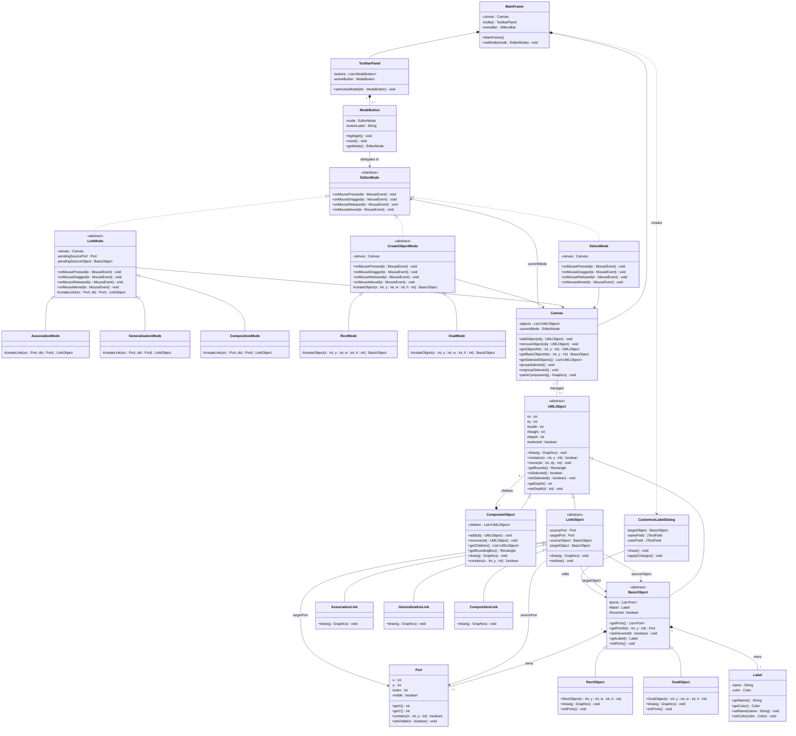

# Class Diagram — Oops UML Editor

```mermaid
classDiagram
    %% ─────────────────────────────────────────
    %% Domain Model: UML Objects
    %% ─────────────────────────────────────────

    class UMLObject {
        <<abstract>>
        #x : int
        #y : int
        #width : int
        #height : int
        #depth : int
        #selected : boolean
        +draw(g : Graphics) void
        +contains(x : int, y : int) boolean
        +move(dx : int, dy : int) void
        +getBounds() Rectangle
        +isSelected() boolean
        +setSelected(s : boolean) void
        +getDepth() int
        +setDepth(d : int) void
    }

    class BasicObject {
        <<abstract>>
        #ports : List~Port~
        #label : Label
        #hovered : boolean
        +getPorts() List~Port~
        +getPortAt(x : int, y : int) Port
        +setHovered(h : boolean) void
        +getLabel() Label
        +initPorts() void
    }

    class RectObject {
        +RectObject(x : int, y : int, w : int, h : int)
        +draw(g : Graphics) void
        +initPorts() void
    }

    class OvalObject {
        +OvalObject(x : int, y : int, w : int, h : int)
        +draw(g : Graphics) void
        +initPorts() void
    }

    class CompositeObject {
        -children : List~UMLObject~
        +add(obj : UMLObject) void
        +remove(obj : UMLObject) void
        +getChildren() List~UMLObject~
        +getBoundingBox() Rectangle
        +draw(g : Graphics) void
        +contains(x : int, y : int) boolean
    }

    class LinkObject {
        <<abstract>>
        -sourcePort : Port
        -targetPort : Port
        -sourceObject : BasicObject
        -targetObject : BasicObject
        +draw(g : Graphics) void
        +redraw() void
    }

    class AssociationLink {
        +draw(g : Graphics) void
    }

    class GeneralizationLink {
        +draw(g : Graphics) void
    }

    class CompositionLink {
        +draw(g : Graphics) void
    }

    %% ─────────────────────────────────────────
    %% Port & Label
    %% ─────────────────────────────────────────

    class Port {
        -x : int
        -y : int
        -index : int
        -visible : boolean
        +getX() int
        +getY() int
        +contains(x : int, y : int) boolean
        +setVisible(v : boolean) void
    }

    class Label {
        -name : String
        -color : Color
        +getName() String
        +getColor() Color
        +setName(name : String) void
        +setColor(color : Color) void
    }

    %% ─────────────────────────────────────────
    %% Editor Modes (Strategy Pattern)
    %% ─────────────────────────────────────────

    class EditorMode {
        <<interface>>
        +onMousePressed(e : MouseEvent) void
        +onMouseDragged(e : MouseEvent) void
        +onMouseReleased(e : MouseEvent) void
        +onMouseMoved(e : MouseEvent) void
    }

    class SelectMode {
        -canvas : Canvas
        +onMousePressed(e : MouseEvent) void
        +onMouseDragged(e : MouseEvent) void
        +onMouseReleased(e : MouseEvent) void
        +onMouseMoved(e : MouseEvent) void
    }

    class LinkMode {
        <<abstract>>
        -canvas : Canvas
        -pendingSourcePort : Port
        -pendingSourceObject : BasicObject
        +onMousePressed(e : MouseEvent) void
        +onMouseDragged(e : MouseEvent) void
        +onMouseReleased(e : MouseEvent) void
        +onMouseMoved(e : MouseEvent) void
        #createLink(src : Port, dst : Port) LinkObject
    }

    class AssociationMode {
        #createLink(src : Port, dst : Port) LinkObject
    }

    class GeneralizationMode {
        #createLink(src : Port, dst : Port) LinkObject
    }

    class CompositionMode {
        #createLink(src : Port, dst : Port) LinkObject
    }

    class CreateObjectMode {
        <<abstract>>
        -canvas : Canvas
        +onMousePressed(e : MouseEvent) void
        +onMouseDragged(e : MouseEvent) void
        +onMouseReleased(e : MouseEvent) void
        +onMouseMoved(e : MouseEvent) void
        #createObject(x : int, y : int, w : int, h : int) BasicObject
    }

    class RectMode {
        #createObject(x : int, y : int, w : int, h : int) BasicObject
    }

    class OvalMode {
        #createObject(x : int, y : int, w : int, h : int) BasicObject
    }

    %% ─────────────────────────────────────────
    %% UI Components
    %% ─────────────────────────────────────────

    class MainFrame {
        -canvas : Canvas
        -toolbar : ToolbarPanel
        -menuBar : JMenuBar
        +MainFrame()
        +setMode(mode : EditorMode) void
    }

    class Canvas {
        -objects : List~UMLObject~
        -currentMode : EditorMode
        +addObject(obj : UMLObject) void
        +removeObject(obj : UMLObject) void
        +getObjectAt(x : int, y : int) UMLObject
        +getBasicObjectAt(x : int, y : int) BasicObject
        +getSelectedObjects() List~UMLObject~
        +groupSelected() void
        +ungroupSelected() void
        +paintComponent(g : Graphics) void
    }

    class ToolbarPanel {
        -buttons : List~ModeButton~
        -activeButton : ModeButton
        +setActiveMode(btn : ModeButton) void
    }

    class ModeButton {
        -mode : EditorMode
        -buttonLabel : String
        +highlight() void
        +reset() void
        +getMode() EditorMode
    }

    class CustomizeLabelDialog {
        -targetObject : BasicObject
        -nameField : JTextField
        -colorField : JTextField
        +show() void
        +applyChanges() void
    }

    %% ─────────────────────────────────────────
    %% Inheritance
    %% ─────────────────────────────────────────

    UMLObject <|-- BasicObject
    UMLObject <|-- CompositeObject
    UMLObject <|-- LinkObject

    BasicObject <|-- RectObject
    BasicObject <|-- OvalObject

    LinkObject <|-- AssociationLink
    LinkObject <|-- GeneralizationLink
    LinkObject <|-- CompositionLink

    EditorMode <|.. SelectMode
    EditorMode <|.. LinkMode
    EditorMode <|.. CreateObjectMode

    LinkMode <|-- AssociationMode
    LinkMode <|-- GeneralizationMode
    LinkMode <|-- CompositionMode

    CreateObjectMode <|-- RectMode
    CreateObjectMode <|-- OvalMode

    %% ─────────────────────────────────────────
    %% Associations & Compositions
    %% ─────────────────────────────────────────

    BasicObject "1" *-- "1..*" Port       : owns
    BasicObject "1" *-- "1" Label         : owns

    CompositeObject "1" *-- "2..*" UMLObject : children

    LinkObject --> Port         : sourcePort
    LinkObject --> Port         : targetPort
    LinkObject --> BasicObject  : sourceObject
    LinkObject --> BasicObject  : targetObject

    Canvas "1" o-- "0..*" UMLObject       : manages
    Canvas --> EditorMode                  : currentMode

    MainFrame *-- Canvas
    MainFrame *-- ToolbarPanel
    MainFrame ..> CustomizeLabelDialog     : creates

    ToolbarPanel "1" *-- "1..*" ModeButton
    ModeButton --> EditorMode              : delegates to

    SelectMode --> Canvas
    LinkMode --> Canvas
    CreateObjectMode --> Canvas

    CustomizeLabelDialog --> BasicObject   : edits
```
