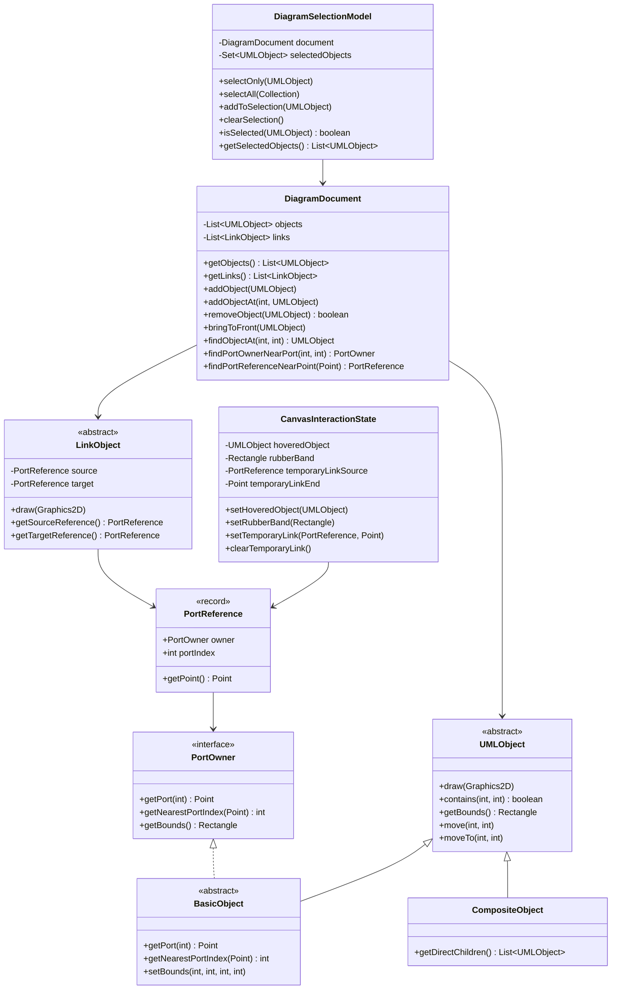
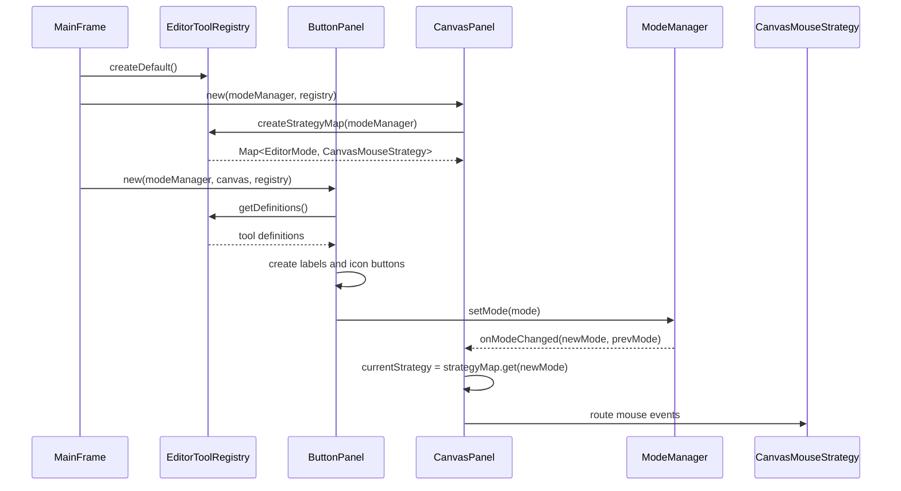
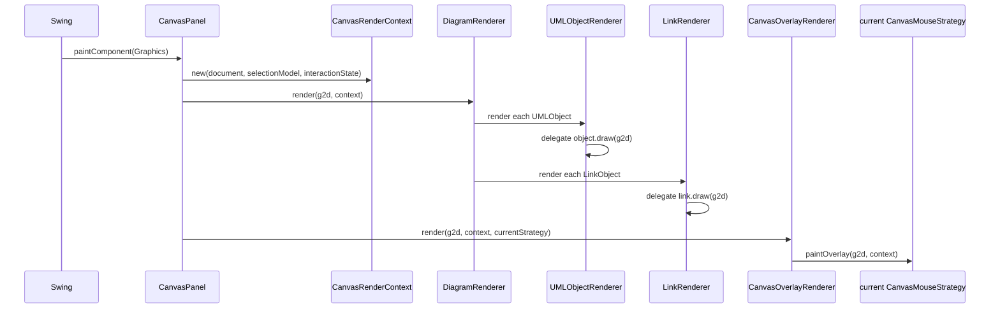
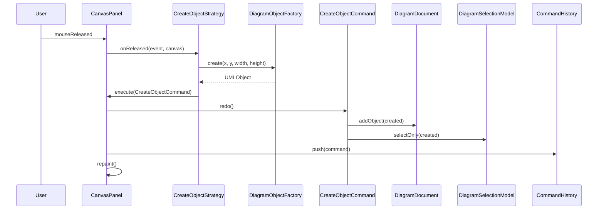
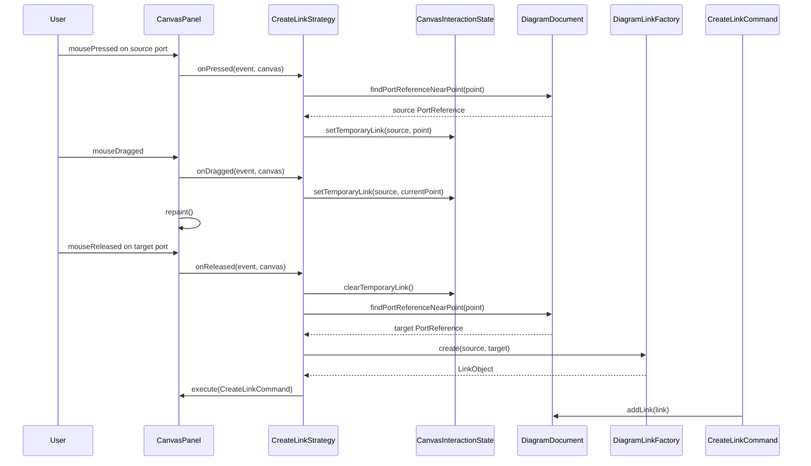
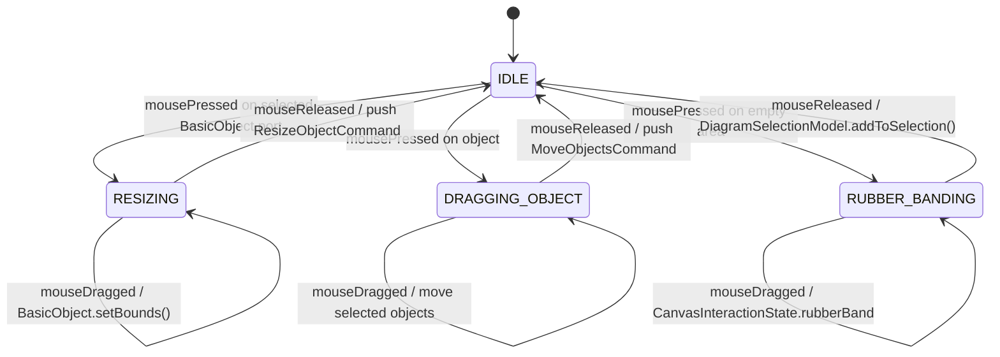
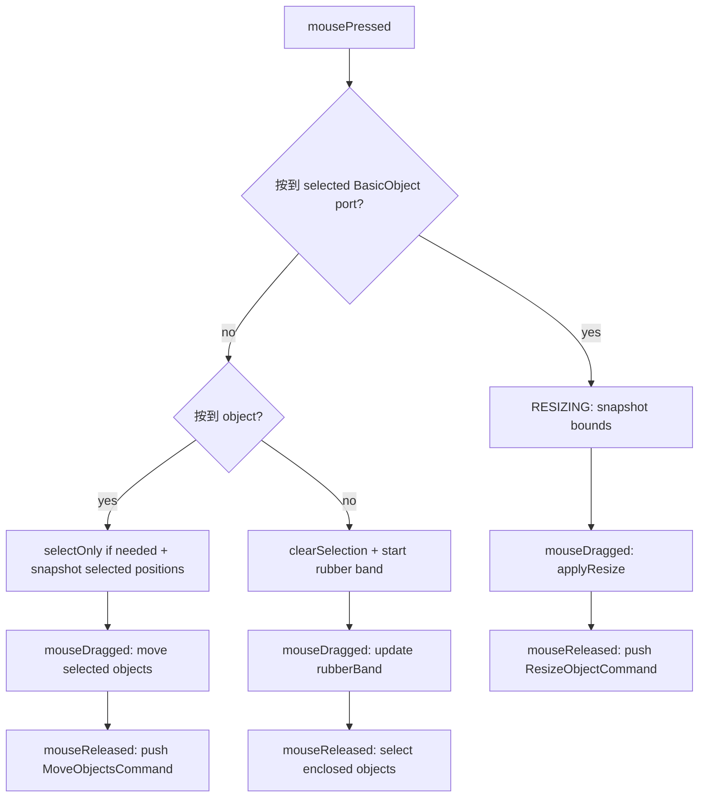
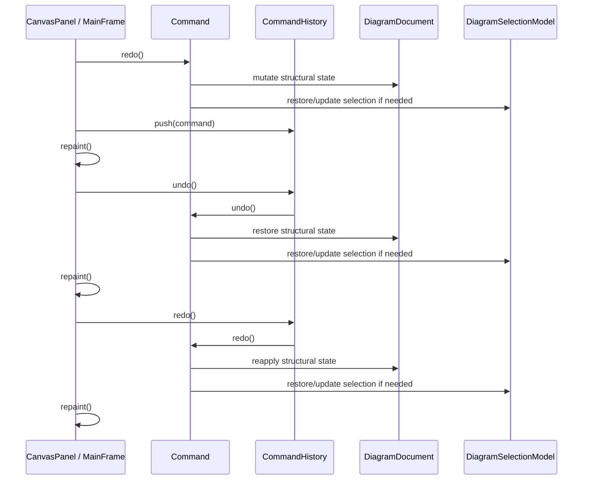
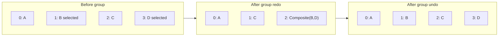
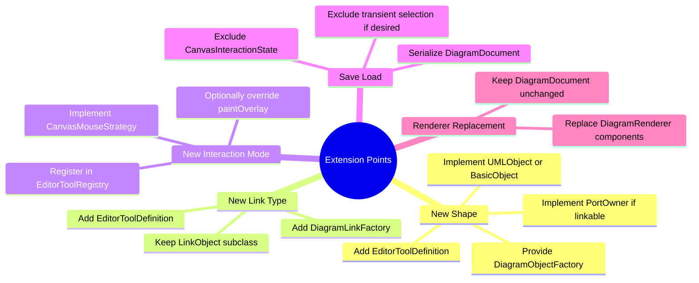

# Refactored UML Editor Architecture

本文描述目前重構後的 UML Editor 設計。重點是說明各程式部件的責任邊界、資料流、工具建立流程、畫布繪製流程、Command undo/redo，以及群組 z-order 的互動方式。

## 1. Responsibility Overview

重構後的核心方向是：`CanvasPanel` 不再是資料、互動、繪製、工具建立、命令執行的唯一中心，而是 Swing adapter。真正的 diagram 結構資料由 `DiagramDocument` 管理；選取狀態由 `DiagramSelectionModel` 管理；暫時互動狀態由 `CanvasInteractionState` 管理；工具定義由 `EditorToolRegistry` 管理；繪製由 renderer layer 管理。

```mermaid
graph TB
    subgraph UI["View / Swing Adapter"]
        MF["MainFrame"]
        BP["ButtonPanel"]
        CP["CanvasPanel"]
        LD["LabelDialog"]
    end

    subgraph TOOL["Tool System"]
        ETR["EditorToolRegistry"]
        ETD["EditorToolDefinition"]
        DOF["DiagramObjectFactory"]
        DLF["DiagramLinkFactory"]
    end

    subgraph STRATEGY["Controller Strategies"]
        CMS["CanvasMouseStrategy"]
        SS["SelectStrategy"]
        COS["CreateObjectStrategy"]
        CLS["CreateLinkStrategy"]
        MM["ModeManager"]
    end

    subgraph MODEL["Diagram Model"]
        DOC["DiagramDocument"]
        SEL["DiagramSelectionModel"]
        CIS["CanvasInteractionState"]
        UO["UMLObject"]
        BO["BasicObject / PortOwner"]
        CO["CompositeObject"]
        LO["LinkObject"]
        PR["PortReference"]
    end

    subgraph RENDER["Renderer Layer"]
        CRC["CanvasRenderContext"]
        DR["DiagramRenderer"]
        UOR["UMLObjectRenderer"]
        LR["LinkRenderer"]
        COR["CanvasOverlayRenderer"]
    end

    subgraph CMD["Command Layer"]
        CH["CommandHistory"]
        C["Command"]
        CC["Create / Move / Resize / Group / Ungroup / Label Commands"]
    end

    MF --> CP
    MF --> BP
    MF --> LD
    MF --> ETR
    BP --> ETR
    CP --> ETR
    ETR --> ETD
    ETD --> DOF
    ETD --> DLF
    ETD --> CMS

    MM --> CMS
    CMS <|.. SS
    CMS <|.. COS
    CMS <|.. CLS

    CP --> DOC
    CP --> SEL
    CP --> CIS
    CP --> CH
    CP --> CRC
    CP --> DR
    CP --> COR

    DR --> UOR
    DR --> LR
    UOR --> UO
    LR --> LO
    COR --> CMS

    C <|.. CC
    CH --> C
    CC --> DOC
    CC --> SEL

    DOC --> UO
    DOC --> LO
    BO --> PR
    LO --> PR
```

## 2. Core Model Relationships

`DiagramDocument` 是 diagram 的結構資料入口，持有頂層 `UMLObject` 與 `LinkObject`，並維護 z-order。`DiagramSelectionModel` 只處理選取狀態；`CanvasInteractionState` 只處理 hover、rubber band、temporary link preview 等 UI 暫態。



## 3. Tool Registration And Strategy Creation

工具定義集中在 `EditorToolRegistry`。`ButtonPanel` 不再維護自己的 `Object[][] defs`；`CanvasPanel` 也不再手寫 strategy map。兩者都由同一份 registry 建立，因此新增工具時主要新增一個 `EditorToolDefinition`。



## 4. Painting Pipeline

`CanvasPanel.paintComponent` 只建立 `CanvasRenderContext`，然後委派給 `DiagramRenderer` 與 `CanvasOverlayRenderer`。一般 diagram 內容與互動 overlay 分開處理。



## 5. Create Object Flow

建立物件時，`CreateObjectStrategy` 不再依賴 `EditorMode.RECT/OVAL` 分支，而是呼叫注入的 `DiagramObjectFactory`。建立後由 `CreateObjectCommand` 寫入 `DiagramDocument` 並更新 `DiagramSelectionModel`。



## 6. Create Link Flow

建立連線時，`CreateLinkStrategy` 透過 `DiagramDocument.findPortReferenceNearPoint` 找出起點與終點。`LinkObject` 端點現在是 `PortReference`，因此未來任何實作 `PortOwner` 的物件都能成為連線端點。



## 7. Selection, Move, Resize Flow

`SelectStrategy` 是選取模式下的互動狀態機。它把真正的 selection 操作交給 `DiagramSelectionModel`，把物件查詢交給 `DiagramDocument`，把 undo/redo 記錄交給 Command。





## 8. Command And Undo/Redo Ownership

Command 不再直接依賴 `CanvasPanel`。Command 只修改 `DiagramDocument` 與必要的 `DiagramSelectionModel`；`CanvasPanel` 負責在 command 完成後 repaint。



## 9. Group / Ungroup Z-Order

群組操作現在會記錄 child 原始 index，並把 composite 放到「被群組物件中最高層的位置」。undo 時 children 回到原始 z-order；redo 時 composite 回到記錄位置。解群組則記錄 composite index，children 會從 composite 位置開始展開。



## 10. Extension Points



## 11. Important Tradeoffs

- `UMLObject.draw(Graphics2D)` and `LinkObject.draw(Graphics2D)` still exist. The renderer layer currently delegates to them to keep the refactor behavior-compatible.
- `UMLObject.selected` and `UMLObject.hovered` still exist as compatibility flags. New flows go through `DiagramSelectionModel` and `CanvasInteractionState`.
- Link subclasses remain unchanged as requested. The current extensibility improvement is at endpoint creation (`PortOwner` / `PortReference`) and factory creation (`DiagramLinkFactory`), not at arrowhead composition.
- `CanvasPanel.rawAddObject` and related raw APIs remain as compatibility adapters, but new Command code no longer depends on them.
