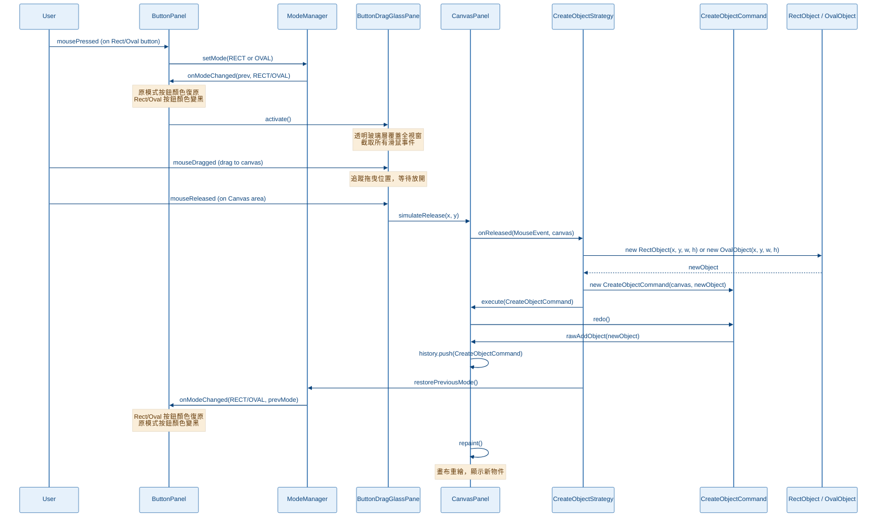
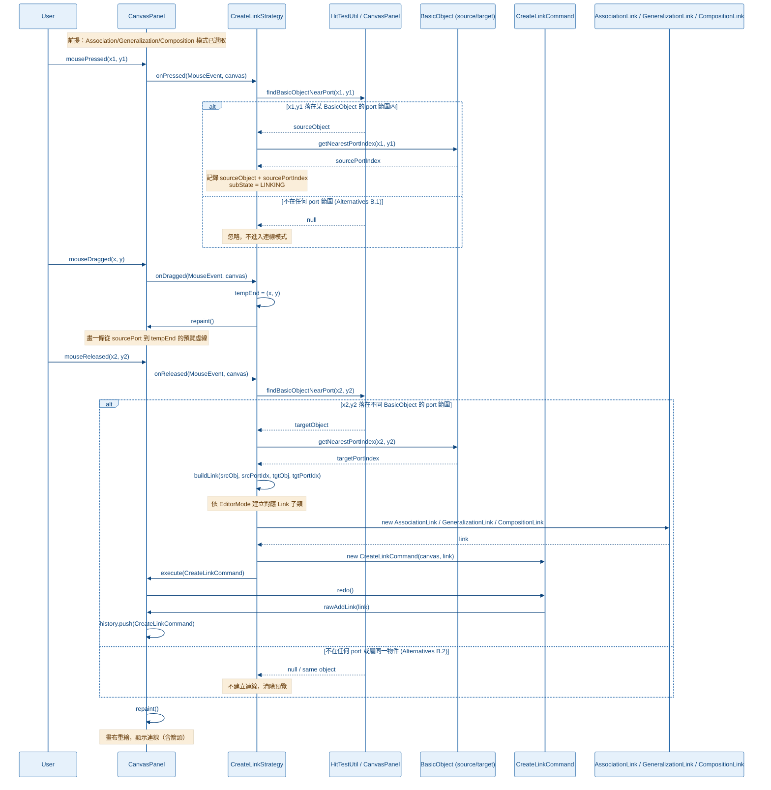
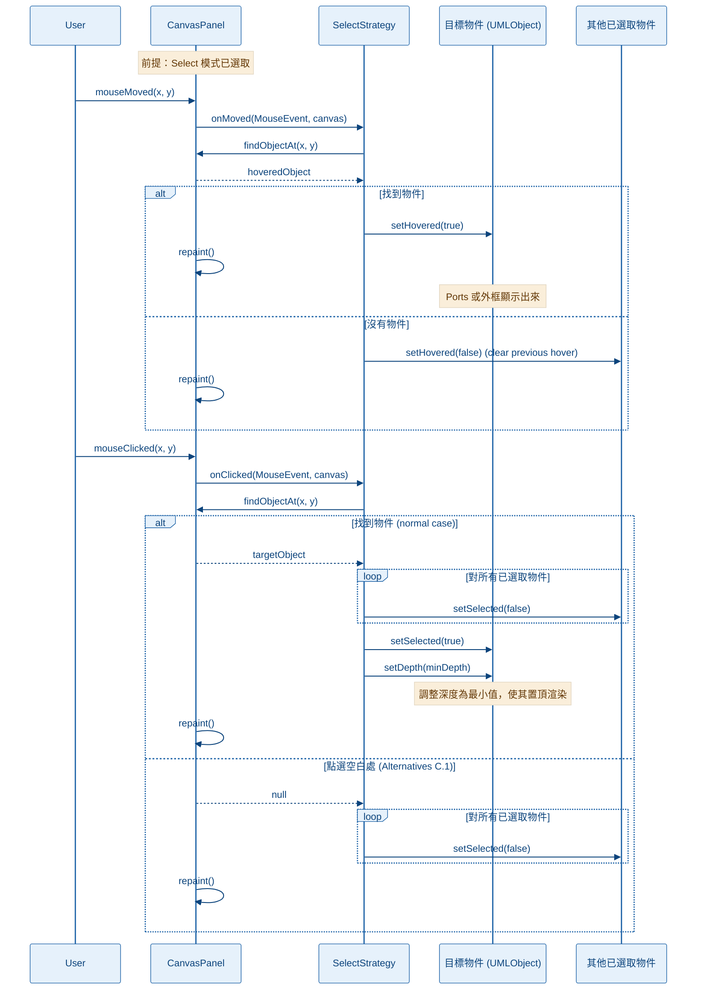
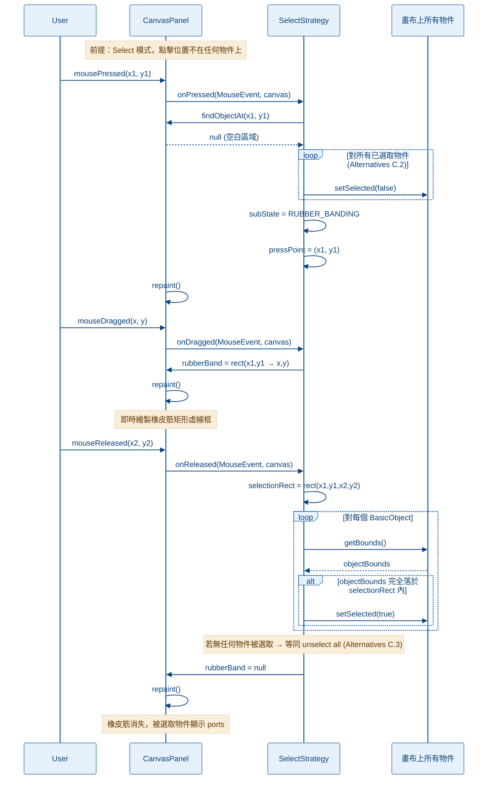
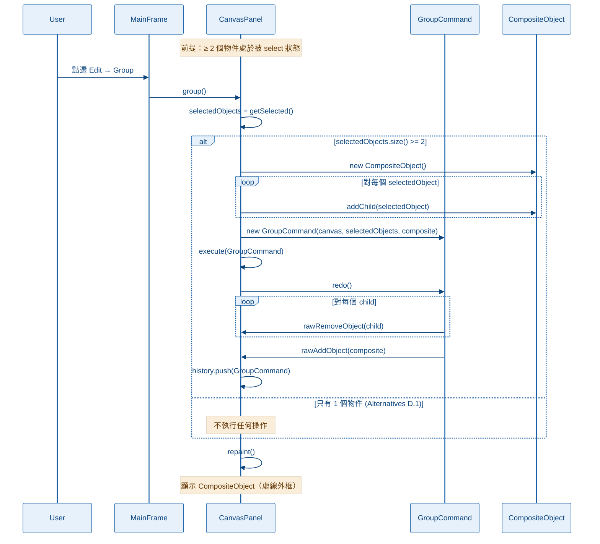
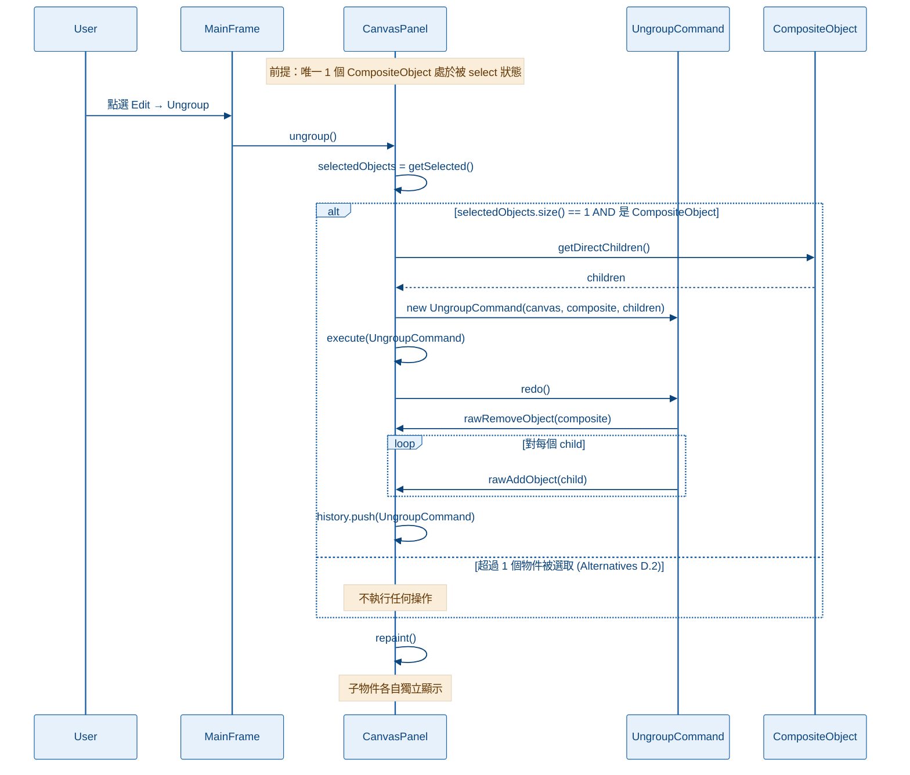
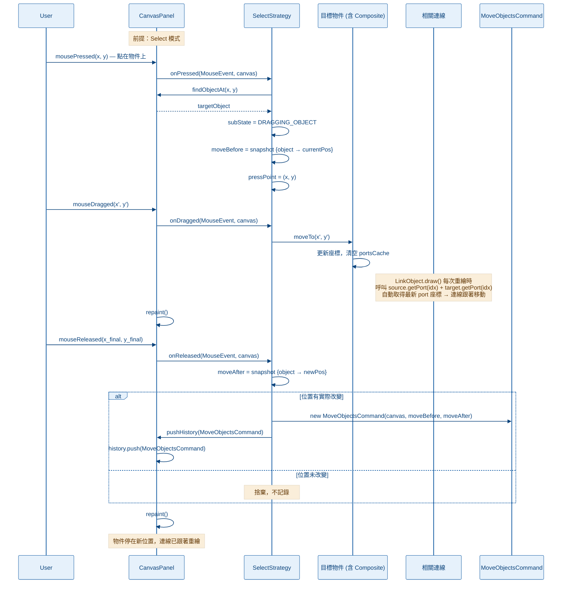
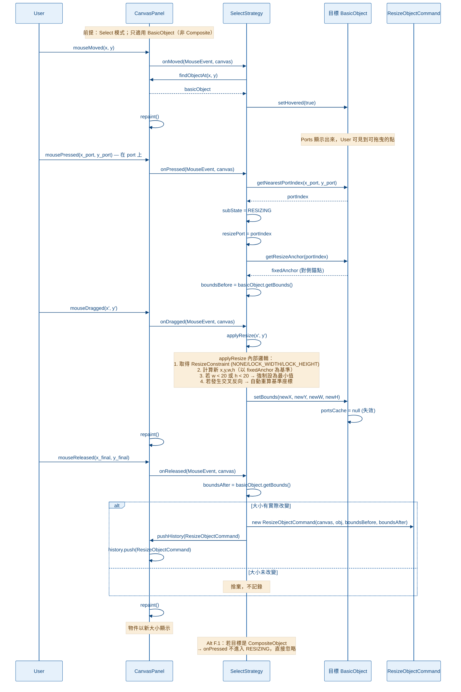
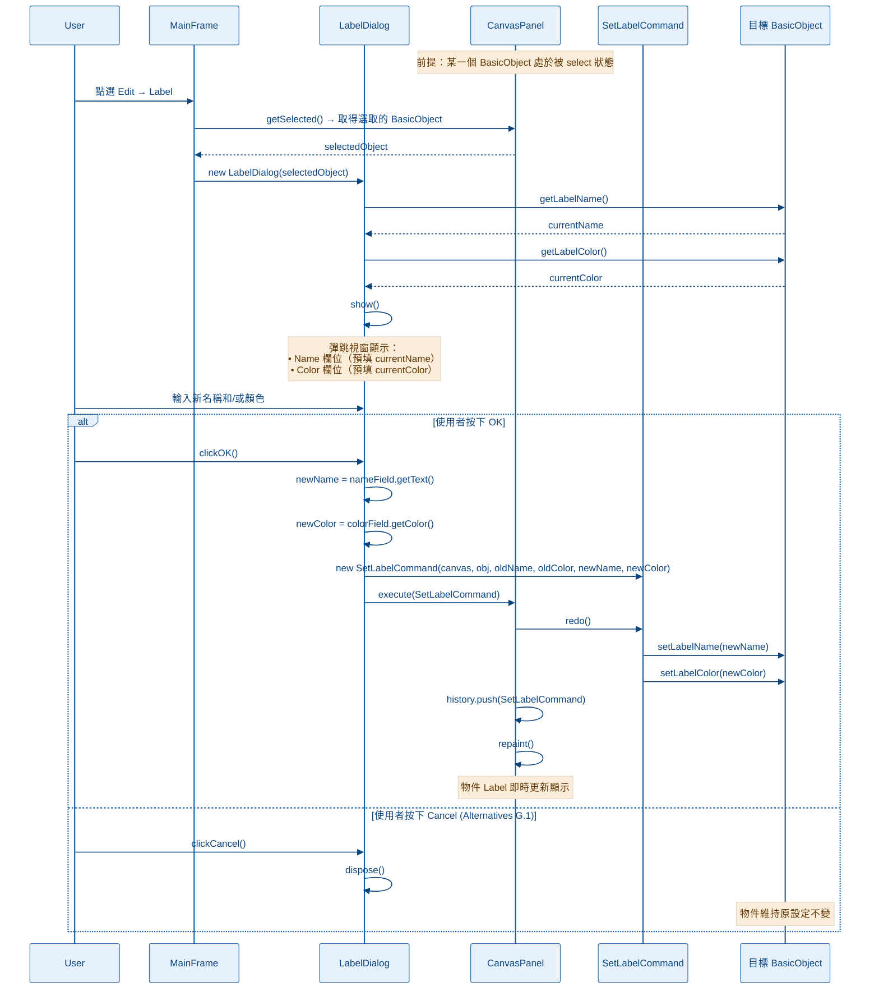

# Sequence Diagrams — Oops UML Editor

> 所有圖表使用 Mermaid，可在 VSCode 安裝 **Markdown Preview Mermaid Support** 後預覽。

---

## 任務二：方法論說明（Use Case → Pseudo Code → Distribute into Classes）

### 思路流程

**Step 1 — Use Case 分析：找出參與者與互動步驟**

閱讀需求文件，識別：
- **Actor**：User（滑鼠事件觸發者）
- **系統邊界**：哪些是 UI 組件、哪些是邏輯層、哪些是資料模型
- **事件序列**：pressed → dragged → released / click → menu action
- **Alternative Flows**：各種邊界條件（滑鼠落點不在物件上、選取數量不符等）

**Step 2 — Pseudo Code：把步驟轉成程式邏輯**

```
// 以 Use Case B (Creating a Link) 為例：

onPressed(event):
    obj = canvas.findBasicObjectNearPort(x, y)
    if obj == null → return (Alternatives B.1)
    sourceObject = obj
    sourcePortIndex = obj.getNearestPortIndex(x, y)
    tempEnd = point(x, y)
    subState = LINKING

onDragged(event):
    tempEnd = point(x, y)
    canvas.repaint()   // 顯示預覽連線

onReleased(event):
    targetObj = canvas.findBasicObjectNearPort(x, y)
    if targetObj == null OR targetObj == sourceObject → return (Alternatives B.2)
    targetPortIndex = targetObj.getNearestPortIndex(x, y)
    link = buildLink(sourceObject, sourcePortIndex, targetObj, targetPortIndex)
    cmd = new CreateLinkCommand(canvas, link)
    canvas.execute(cmd)   // cmd.redo() + history.push(cmd)
```

**Step 3 — Distribute into Classes：按職責分配方法**

| 職責類型 | 對應類別 | 例子 |
|---|---|---|
| 滑鼠事件入口 | `CanvasPanel` | 路由給 strategy |
| 互動邏輯 | `CanvasMouseStrategy` 子類 | `onPressed/Dragged/Released` |
| 碰撞偵測 | `HitTestUtil` / `CanvasPanel` | `findObjectAt`, `findBasicObjectNearPort` |
| 物件工廠 | `CreateLinkStrategy.buildLink()` | 依 EditorMode 建對應 Link |
| 資料變更 | `Command` 子類 的 `redo()` | `rawAddObject`, `rawAddLink` |
| 歷史紀錄 | `CommandHistory` | `push`, `undo`, `redo` |
| 狀態管理 | `ModeManager` / `SelectStrategy.subState` | 全域模式 + 子狀態 |
| UI 回饋 | `CanvasPanel.repaint()` / `ButtonPanel.onModeChanged()` | 重繪畫布、高亮按鈕 |
| 屬性儲存 | `UMLObject` 子類 | 座標、深度、label |

---

## 任務三：每個方法的概略行為

### CanvasPanel（畫布主控）

| 方法 | 行為 |
|---|---|
| `execute(cmd)` | 呼叫 `cmd.redo()` 套用變更，再把 cmd 推入 undoStack；適用「一次性建立」操作 |
| `pushHistory(cmd)` | 只推入 undoStack，不重複執行 redo；適用已即時更新的 Move/Resize |
| `rawAddObject(obj)` | 直接把 UMLObject 加入 objects 列表，不走 Command；供 Command.redo/undo 呼叫 |
| `rawRemoveObject(obj)` | 從 objects 列表移除物件；供 Command.undo 呼叫 |
| `rawAddLink(link)` | 把 LinkObject 加入 links 列表 |
| `rawRemoveLink(link)` | 從 links 列表移除 LinkObject |
| `findObjectAt(x,y)` | 依 depth 排序後，回傳第一個 `contains(x,y)==true` 的物件 |
| `findBasicObjectNearPort(x,y)` | 掃描所有 BasicObject，回傳距離最近的 port 在範圍內的物件 |
| `group()` | 確認 ≥2 個物件被選取後，建立 GroupCommand 並 execute |
| `ungroup()` | 確認唯一選取物件是 CompositeObject，建立 UngroupCommand 並 execute |
| `simulateRelease(x,y)` | 由 ButtonDragGlassPane 呼叫，模擬滑鼠在畫布上放開，觸發 CreateObjectStrategy.onReleased |

### SelectStrategy（選取/移動/縮放策略）

| 方法 | 行為 |
|---|---|
| `onMoved(e, canvas)` | hover 偵測：找物件 → setHovered(true) 顯示 ports，離開後 setHovered(false) |
| `onPressed(e, canvas)` | 判斷落點：在 port → subState=RESIZING；在物件 → subState=DRAGGING_OBJECT（記錄 moveBefore 快照）；在空白 → subState=RUBBER_BANDING（取消所有選取）|
| `onDragged(e, canvas)` | RESIZING：呼叫 applyResize 即時更新物件大小；DRAGGING_OBJECT：呼叫 object.moveTo 即時移動；RUBBER_BANDING：更新橡皮筋矩形 |
| `onReleased(e, canvas)` | RESIZING：快照 boundsAfter → pushHistory(ResizeObjectCommand)；DRAGGING_OBJECT：快照 moveAfter → pushHistory(MoveObjectsCommand)；RUBBER_BANDING：框選完全落於矩形內的物件 |
| `onClicked(e, canvas)` | 找出點選物件 → unselect 其他物件 → select 此物件 → 調深度為最小 |
| `applyResize(newPoint)` | 根據 resizePort 和 ResizeConstraint，計算新的 x/y/width/height（含最小尺寸限制與交叉方向處理），呼叫 setBounds |

### CreateObjectStrategy（建立形狀策略）

| 方法 | 行為 |
|---|---|
| `onReleased(e, canvas)` | 確認滑鼠在 Canvas 範圍內 → 建立 RectObject 或 OvalObject → 包成 CreateObjectCommand → canvas.execute |
| `（呼叫後）` | 結束後呼叫 ModeManager.restorePreviousMode() 回到原模式，ButtonPanel 收到通知後高亮更新 |

### CreateLinkStrategy（建立連線策略）

| 方法 | 行為 |
|---|---|
| `onPressed(e, canvas)` | 找最近 port 的 BasicObject → 記錄 sourceObject 和 sourcePortIndex → subState=LINKING |
| `onDragged(e, canvas)` | 更新 tempEnd 座標 → repaint（畫虛線預覽） |
| `onReleased(e, canvas)` | 找 targetObject 和 targetPortIndex → 驗證不同物件 → buildLink() → CreateLinkCommand → execute |
| `buildLink(src, srcIdx, tgt, tgtIdx)` | 工廠方法，依目前 EditorMode 建立 AssociationLink / GeneralizationLink / CompositionLink |

### BasicObject（抽象形狀）

| 方法 | 行為 |
|---|---|
| `getPorts()` | 若 portsCache 為 null 則呼叫 computePorts() 重算；否則直接回傳快取 |
| `computePorts()` | 子類實作，計算每個 port 的絕對座標（RectObject=8個，OvalObject=4個） |
| `getNearestPortIndex(pt)` | 用 Chebyshev 距離找最近的 port，回傳其 index |
| `getResizeConstraint(portIdx)` | 回傳此 port 的縮放軸鎖（邊中點鎖單軸，角點自由縮放） |
| `getResizeAnchor(portIdx)` | 回傳縮放時的對側固定錨點座標 |
| `setBounds(x,y,w,h)` | 更新座標與尺寸，並將 portsCache 設為 null 使其失效 |
| `move(dx,dy)` / `moveTo(x,y)` | 移動物件並清空 portsCache，確保 LinkObject.draw() 下次取到最新 port 座標 |
| `draw(g)` | Template Method：依序呼叫 drawShape → drawPorts（hoverd/selected 才顯示）→ drawLabel |

### CompositeObject（群組物件）

| 方法 | 行為 |
|---|---|
| `addChild(obj)` | 將子物件加入 children 列表 |
| `removeChild(obj)` | 從 children 列表移除子物件 |
| `getBounds()` | 遞迴計算所有子物件的最小外包矩形 |
| `draw(g)` | 遞迴 draw 所有 children；若 selected 則繪製虛線外框 |
| `move(dx,dy)` | 遞迴對所有 children 呼叫 move |
| `contains(x,y)` | 以 getBounds() 的外包矩形做命中測試 |

### Command 子類

| Command | redo() | undo() |
|---|---|---|
| `CreateObjectCommand` | rawAddObject(obj) | rawRemoveObject(obj) |
| `CreateLinkCommand` | rawAddLink(link) | rawRemoveLink(link) |
| `MoveObjectsCommand` | 套用 moveAfter Map 中每個物件的 moveTo | 套用 moveBefore Map 復原 |
| `ResizeObjectCommand` | 套用 boundsAfter 呼叫 setBounds | 套用 boundsBefore 復原 |
| `GroupCommand` | 移除 children → 建立 CompositeObject → rawAddObject | rawRemoveObject(composite) → 還原 children |
| `UngroupCommand` | rawRemoveObject(composite) → rawAddObject 每個 child | 復原為 CompositeObject |
| `SetLabelCommand` | 設定新的 labelName + labelColor | 還原舊的 labelName + labelColor |

### ModeManager（狀態管理）

| 方法 | 行為 |
|---|---|
| `setMode(mode)` | 儲存 previousMode、更新 currentMode、通知所有 ModeChangeListener |
| `restorePreviousMode()` | 將 currentMode 恢復為 previousMode，通知 listeners（用於建立物件後回復模式）|
| `addListener(l)` | 註冊 ModeChangeListener（ButtonPanel 實作此介面）|

---

## 任務一：Use Case Sequence Diagrams

---

### UC-A：Creating an Object（建立形狀）

**思路：** User 在工具按鈕上按下後拖曳至 Canvas 放開，ButtonDragGlassPane 作為中介接管全視窗事件，模擬在 Canvas 上放開的效果。



---

### UC-B：Creating a Link（建立連線）

**思路：** Link 模式下，onPressed 找 source port，onDragged 畫預覽線，onReleased 找 target port 後由 buildLink 工廠建立對應連線物件。



---

### UC-C Case 1：Select / Unselect — 單擊選取

**思路：** onMoved 做 hover 偵測顯示 ports，onClicked 做正式選取並取消其他物件選取狀態，調整 depth 至最小使其置頂。



---

### UC-C Case 2：Select / Unselect — 框選（Rubber Band）

**思路：** 在空白處按下並拖曳，即時顯示橡皮筋矩形；放開後計算哪些物件完全落於矩形內，選取它們。



---

### UC-D Case 1：Group Objects（群組）

**思路：** 確認 ≥2 個物件被選取後，透過 GroupCommand 把它們包成一個 CompositeObject，原物件從頂層列表移除。



---

### UC-D Case 2：Ungroup Objects（解群組）

**思路：** 確認唯一選取物件是 CompositeObject 後，透過 UngroupCommand 將其拆解，子物件回到頂層列表。



---

### UC-E：Move Objects（移動物件）

**思路：** onPressed 快照 moveBefore，onDragged 即時移動（連線 port 動態追蹤自動更新），onReleased 快照 moveAfter 後 pushHistory。



---

### UC-F：Resize Objects（調整物件大小）

**思路：** 在 BasicObject 的 port 上按下後進入 RESIZING 子狀態，onDragged 即時 applyResize（含軸鎖定、最小尺寸、交叉反向處理），onReleased pushHistory。



---

### UC-G：Customize Label Style（自定義標籤）

**思路：** 選取 BasicObject 後從 Edit Menu 開啟 LabelDialog；OK 時包成 SetLabelCommand 執行；Cancel 則不做任何改變。


