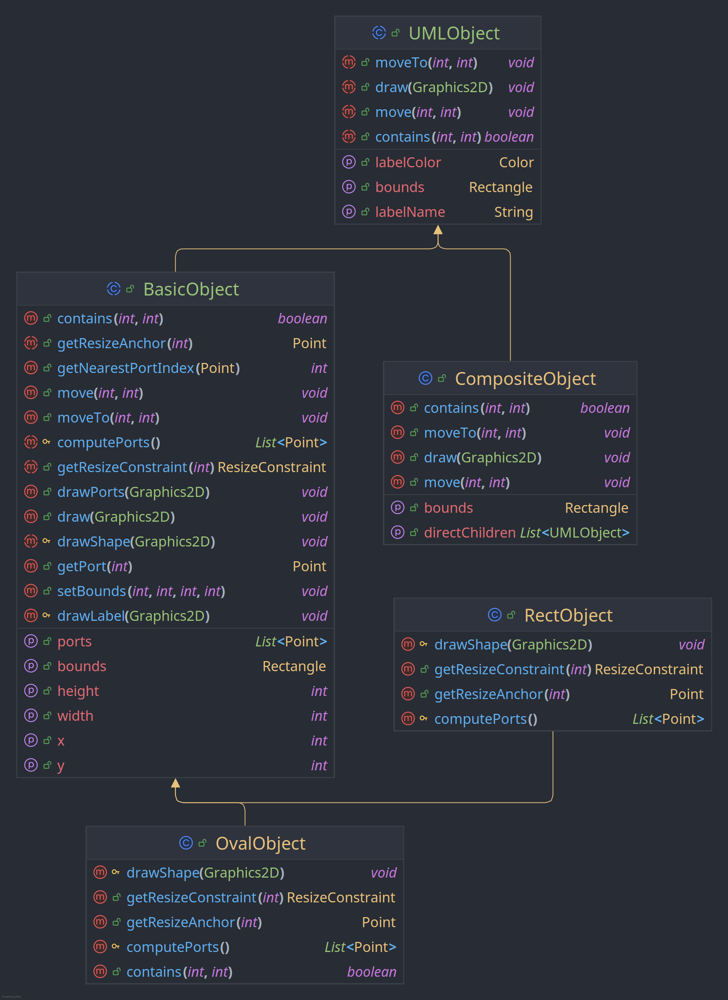
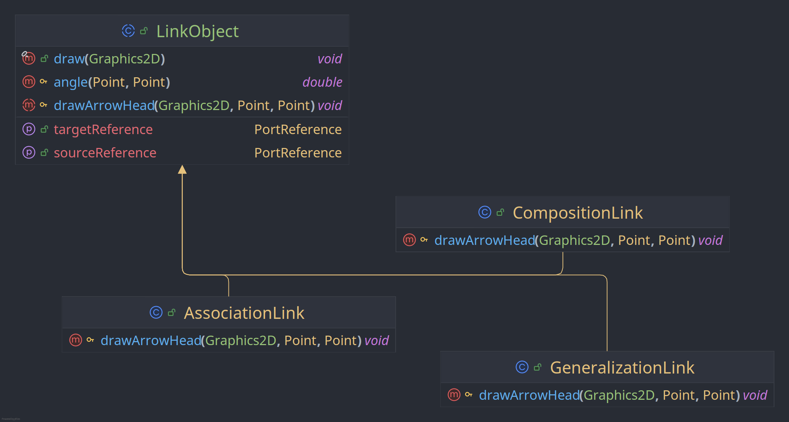
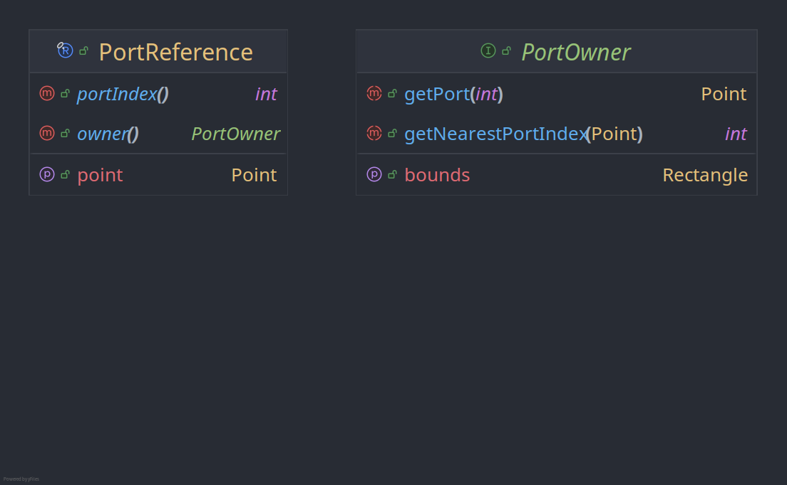
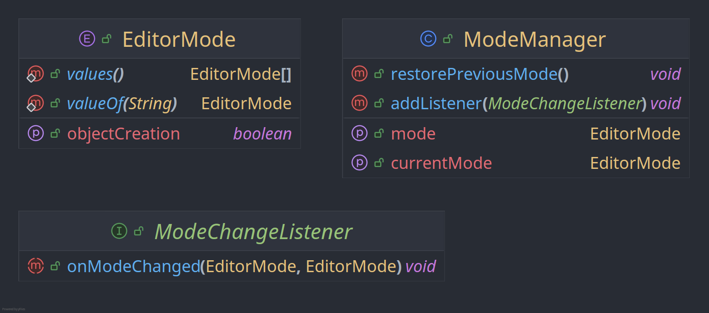
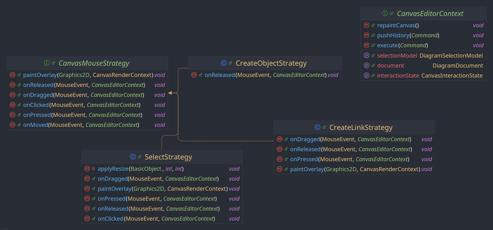
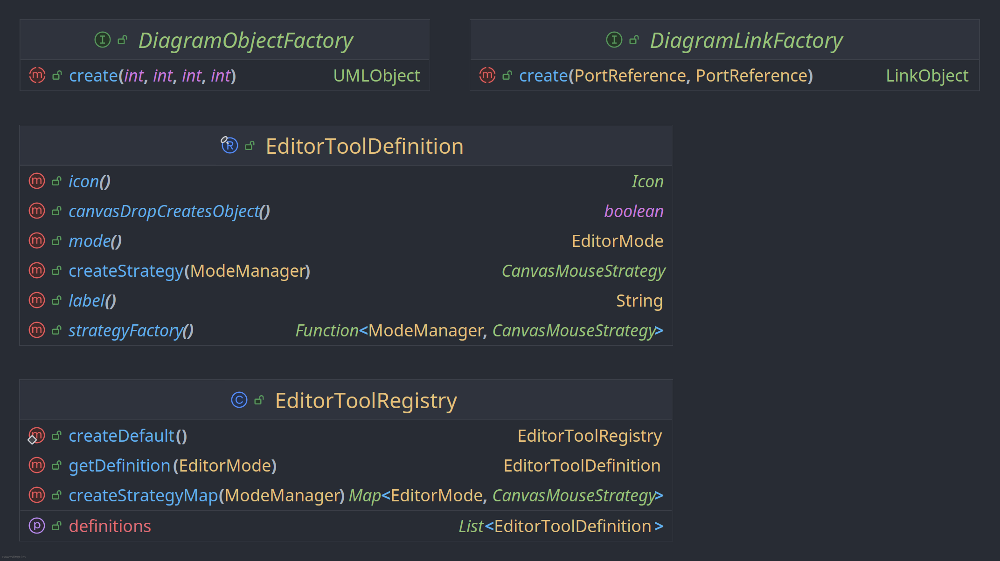
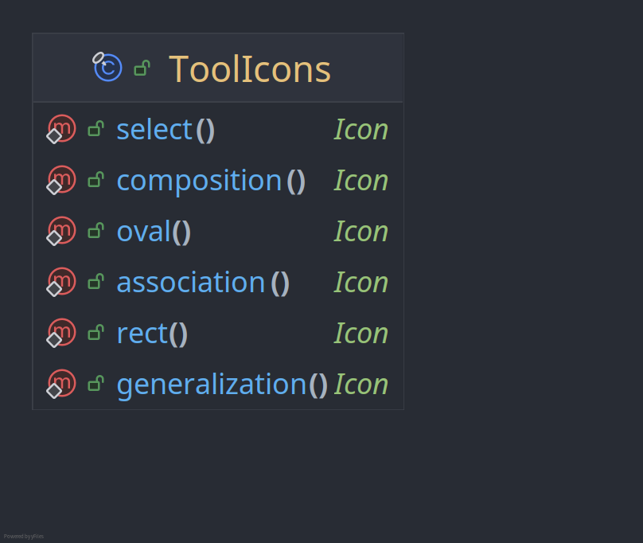
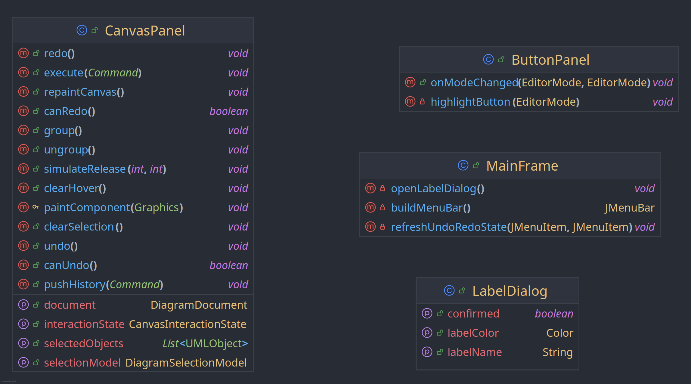
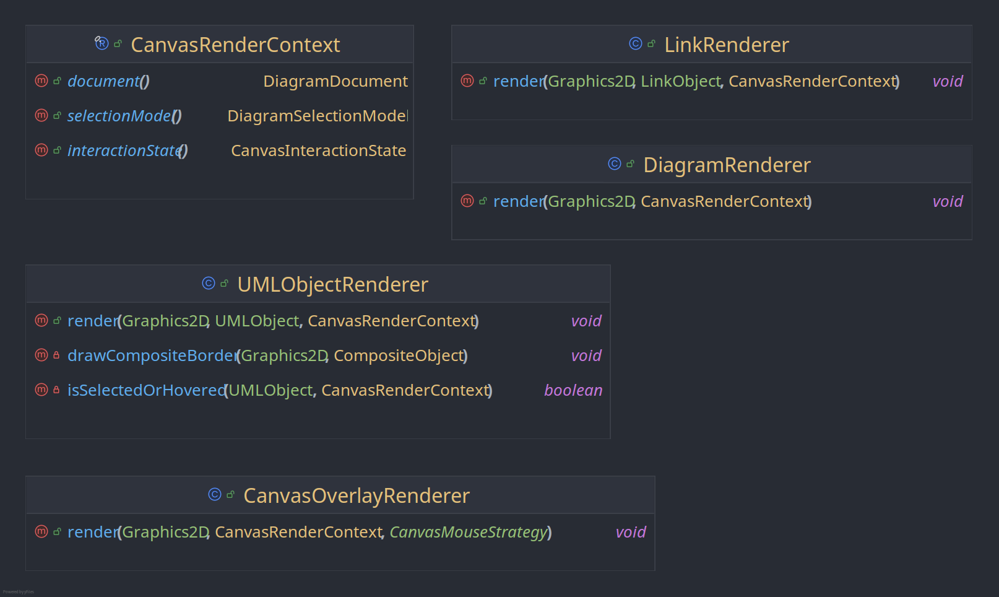

# Class Diagram

<table style="width: 100%; border-collapse: collapse; margin: 0 0 10px 0;">
  <tr>
    <td style="width: 50%; vertical-align: top; padding-right: 6px;">
      
    </td>
    <td style="width: 50%; vertical-align: top; padding-left: 6px;">
      
    </td>
  </tr>
</table>

